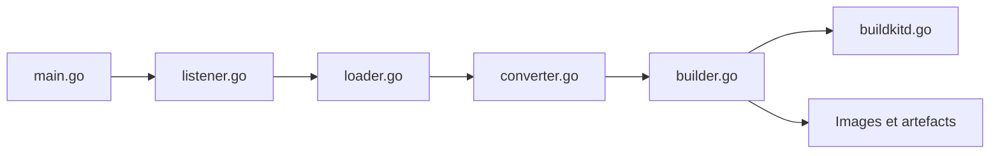

# earthly/earthly

> Framework de build en conteneurs, aux Earthfiles proches de Dockerfile et Makefile, déclaré non maintenu.

## Le problème
Des builds qui diffèrent entre portable, collègues et CI, et du glue code répété.

## Ce que ça fait vraiment
Lit un `Earthfile` en cibles, exécute chaque cible en conteneur via BuildKit, parallélise et met en cache. Les cibles se référencent par `+` (locales, autres dossiers, autres dépôts) et peuvent sortir images et artefacts. `FROM DOCKERFILE` réutilise un Dockerfile.

## Comment c'est branché


## Essayer
```bash
earthly +all
earthly github.com/earthly/earthly/examples/go:main+docker
```
Le README renvoie à son guide d'installation.

## Coût et pièges
Gratuit, demande un démon BuildKit. 744 issues ouvertes.

## Ce que ce n'est pas
Le README affiche en tête : « Earthly is no longer actively maintained » : à ne pas adopter en nouveau projet. Pas un remplacement de Bazel (le README les distingue).

## Alternatives
- Bazel : comparé dans le README, système de build pour monorepos.
- Dockerfiles seuls : évoqués dans le README pour des images uniques.

## Pour toi
À ignorer : le projet se déclare non maintenu, donc risqué pour une chaîne CI/CD durable.

