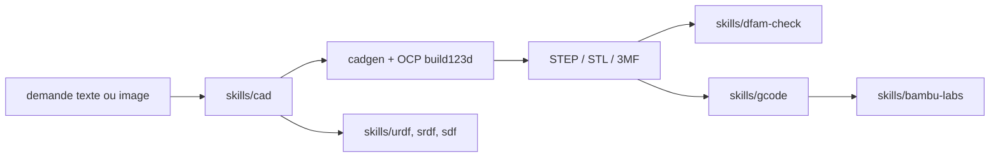

# earthtojake/text-to-cad

> Bibliothèque de skills d'agent pour la CAO, la fabrication et les fichiers robot.

## Le problème
Demander à un agent de produire une pièce mécanique ou un URDF sans outillage donne
du texte plausible et des fichiers inexploitables par un slicer ou un simulateur.

## Ce que ça fait vraiment
Onze skills, chacune avec son dossier `skills/`. **CAD** crée et édite des modèles
depuis une demande en langage naturel ou une image, sortie principale STEP avec
export STL, 3MF, GLB. **CAD Viewer** affiche un aperçu local dans le navigateur.
**step.parts** cherche des pièces sur étagère (vis, roulements, moteurs,
connecteurs). **DXF** produit des plans 2D. **URDF**, **SRDF**, **SDF** écrivent les
fichiers de description robot, groupes de planification MoveIt et mondes de
simulation. **SendCutSend** vérifie les fichiers avant envoi, **DfAM Check** mesure
l'imprimabilité (épaisseur de paroi, porte-à-faux, volume de support, orientation),
**G-code** tranche avec de vrais CLI de slicer, **Bambu Labs** lance prudemment une
impression locale.

## Comment c'est branché


## Essayer
```bash
npx skills add earthtojake/text-to-cad
codex plugin marketplace add earthtojake/text-to-cad
claude plugin marketplace add earthtojake/text-to-cad
claude plugin install cad@text-to-cad
```

## Coût et pièges
Gratuit. Piège documenté : `npx skills update` ne rafraîchit que les skills déjà
dans le lockfile et rate silencieusement les nouvelles — il faut relancer
`npx skills add`. Sous Windows 11, Smart App Control bloque le module natif non
signé d'OCP : toute commande `cadgen` échoue, sans exception possible par
application ; il faut désactiver la protection ou passer par WSL.

## Ce que ce n'est pas
Pas un logiciel de CAO ni un service en ligne : des skills qui pilotent un noyau
local (OCP/OpenCascade). Le corpus de fixtures `models/` arrive en pointeurs LFS et
n'est pas nécessaire. Aucune licence déclarée dans le README.

## Alternatives
- Aucun dépôt alternatif nommé dans le README.

## Pour toi
Hors périmètre data/IA. À ignorer, sauf projet mécanique personnel.
