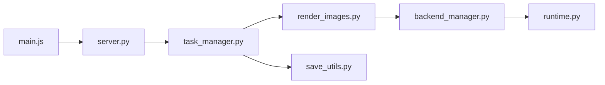

# easydiffusion/easydiffusion

> Installeur en un clic pour générer des images avec Stable Diffusion sur son ordinateur.

## Le problème
Installer Stable Diffusion demande des connaissances techniques et des dépendances.

## Ce que ça fait vraiment
Fournit une interface web locale : texte vers image, image vers image, inpainting, ControlNet, 16 échantillonneurs, SDXL, correction de visage (GFPGAN), upscaling (RealESRGAN), file de tâches, modificateurs de style, plugins. Le serveur Python gère les tâches et délègue à un moteur d'inférence. Le README annonce des modèles récents (Flux 1 et 2, Z-Image) sur le moteur v4.

## Comment c'est branché


## Essayer
```bash
./start.sh
```
Sous Windows : lancer `Easy-Diffusion-Windows.exe`.

## Coût et pièges
8 Go de RAM minimum, 25 Go de disque, GPU NVIDIA ou AMD (ou CPU, lent). Licence non identifiée par GitHub : la licence interdit certains contenus, à lire avant usage.

## Ce que ce n'est pas
Pas un service hébergé. Les performances annoncées (5 s en 512×512 sur une 3060) sont celles du README, non vérifiées ici.

## Alternatives
Aucune alternative nommée dans le README.

## Pour toi
À surveiller : pratique pour générer des images en local sans coder, mais licence à lire avant tout usage professionnel.

