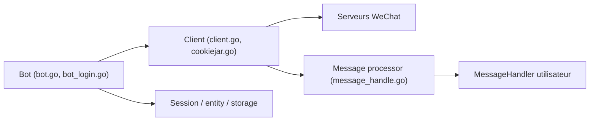

# eatmoreapple/openwechat

> Bibliothèque Go pour piloter un compte WeChat personnel et écrire des robots de messagerie.

## Le problème
WeChat n'offre pas d'API simple pour un compte personnel ; les robots doivent passer par la connexion web.

## Ce que ça fait vraiment
Un paquet Go : connexion par code QR (avec connexion à chaud pour éviter de rescanner), gestionnaire de messages en rappel, réponse et envoi de texte, images, fichiers, emoji ; liste des amis et groupes ; plusieurs comptes simultanés ; antirévocation. README en chinois.

## Comment c'est branché


## Essayer
```bash
go get -u github.com/eatmoreapple/openwechat
```

## Coût et pièges
Gratuit. Compte WeChat requis. Dernier push en janvier 2025. Le README dit « contourner les limites de connexion » ; les risques pour le compte ne sont pas documentés.

## Ce que ce n'est pas
Pas une API officielle de WeChat ni un outil pour les comptes de type public. Sa stabilité dépend de WeChat, non documentée.

## Alternatives
Aucune alternative nommée dans le README.

## Pour toi
À ignorer : dépendance à un service tiers non officiel, projet d'une seule personne, peu actif, sans lien avec la donnée ou l'IA.

