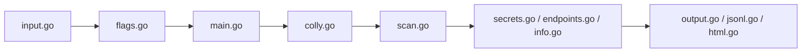

# edoardottt/cariddi

> Explorateur d'URL en ligne de commande qui repère endpoints, secrets et fichiers sensibles, pour tests autorisés.

## Le problème
Lors d'un audit, repérer à la main les endpoints exposés, clés d'API et jetons dans de nombreuses pages est long.

## Ce que ça fait vraiment
- Lit des cibles sur l'entrée standard et explore les pages avec le crawler Colly (`colly.go`).
- Analyse les réponses (`scan.go`) pour détecter secrets, endpoints, extensions de fichiers, erreurs et informations utiles.
- Options : concurrence, délai, proxy HTTP/SOCKS5, en-têtes personnalisés, user-agent aléatoire, profondeur maximale, cache.
- Sorties : console, TXT, HTML, JSON, archive des réponses HTTP ; intégration possible avec le proxy Burp.

## Comment c'est branché


## Essayer
```bash
brew install cariddi
go install -v github.com/edoardottt/cariddi/cmd/cariddi@latest
echo https://edoardottt.com/ | cariddi
cat urls.txt | cariddi -s -e -json
echo "https://edoardottt.github.io/cariddi-test/" | cariddi
```

## Coût et pièges
Gratuit, binaire Go (Go 1.24+ pour compiler). Le niveau de concurrence par défaut est 20 : régler `-c` et `-d` pour ne pas surcharger la cible.

## Ce que ce n'est pas
Ce n'est pas un scanner de vulnérabilités complet : il repère des indices dans des réponses. À n'utiliser que sur des cibles dont tu es propriétaire ou pour lesquelles tu as une autorisation ; le README n'inclut pas d'avertissement légal explicite. Licence GPL-3.0.

## Alternatives
Aucune alternative nommée dans le README (il remercie go-colly et projectdiscovery).

## Pour toi
Surveiller : utile pour auditer tes propres applications (fuites de secrets dans des pages exposées), sans lien direct avec le travail data/MLOps hors audit de sécurité.

