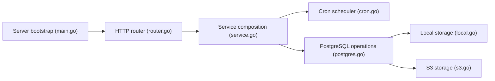

# eduardolat/pgbackweb

> Interface web pour planifier, surveiller et restaurer des sauvegardes PostgreSQL, pour développeurs et petites équipes.

## Le problème
Les sauvegardes `pg_dump` en cron manquent de suivi, de notifications et de restauration en un clic.

## Ce que ça fait vraiment
Application Go avec base PostgreSQL propre : tu déclares bases et destinations (local ou plusieurs buckets S3), planifies des sauvegardes, consultes les journaux d'exécution, télécharges ou restaures, reçois des webhooks. Compatible PostgreSQL 13 à 18, avec chiffrement PGP et vérifications de santé. Le projet devient « UFO Backup ».

## Comment c'est branché


## Essayer
```bash
# docker compose avec l'image eduardolat/pgbackweb:latest, variables :
# PBW_ENCRYPTION_KEY et PBW_POSTGRES_CONN_STRING
docker exec -it <container_name_or_id> sh -c change-password
```

## Coût et pièges
Gratuit. Conserver `PBW_ENCRYPTION_KEY` en lieu sûr : elle chiffre les données sensibles. Une base PostgreSQL dédiée est nécessaire. Licence AGPL-3.0.

## Ce que ce n'est pas
Pas multi-moteurs pour l'instant (PostgreSQL seul). Pas une garantie de reprise sur sinistre : tester les restaurations reste à ta charge.

## Alternatives
Aucune alternative nommée dans le README.

## Pour toi
À adopter pour sauvegarder des bases PostgreSQL de plateformes ML sans écrire de scripts ; pense à tester une restauration.

