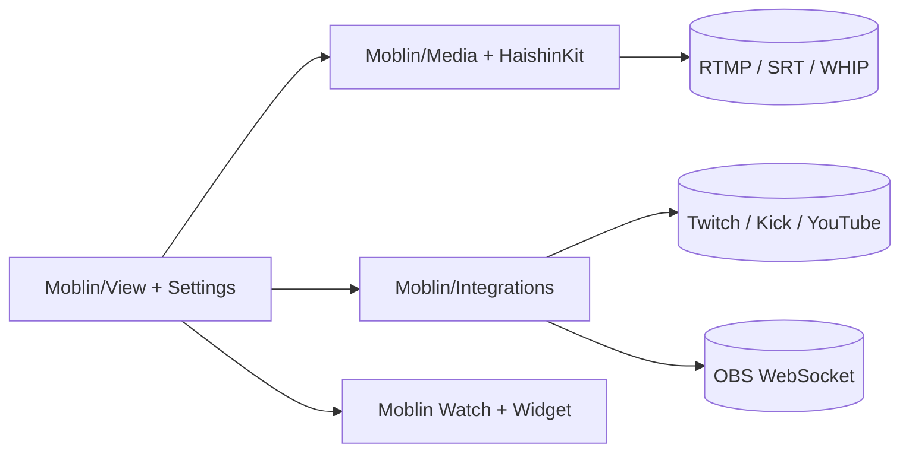

# eerimoq/moblin

> Application iOS gratuite de streaming en extérieur (RTMP, SRT, WHIP) pour Twitch, YouTube, Kick et OBS.

## Le problème
Diffuser en direct depuis un téléphone avec plusieurs connexions, des incrustations et du chat demande un mélange d'applications.

## Ce que ça fait vraiment
Diffuse en RTMP(S), SRT(LA), RIST ou WHIP avec agrégation de connexions (cellulaire, Wi-Fi, Ethernet), scènes et widgets (chat, alertes, carte, météo, scores), effets vidéo, enregistrement local et télécommande d'OBS. Intégrations Twitch, Kick, YouTube, appareils DJI, application Apple Watch, import de réglages par `moblin://` et API JavaScript pour widget navigateur.

## Comment c'est branché


## Essayer
```bash
git clone https://github.com/eerimoq/moblin.git
cd moblin
cp User.template.xcconfig Config/User.xcconfig
open Moblin.xcodeproj
```

## Coût et pièges
Gratuit ; la compilation exige Xcode et un iPhone en mode développeur ; TestFlight disponible. 120 FPS « à vos risques ». Le README avertit que la vidéo ne se capture pas en arrière-plan.

## Ce que ce n'est pas
Ce n'est pas un logiciel de studio : c'est une app mobile. La liste de fonctions du README est très longue, sans indication de maturité par élément.

## Alternatives
- irlpro.app : app de streaming en extérieur.
- Larix (softvelum.com) : application de diffusion iOS.
- Application Twitch.

## Pour toi
À ignorer : outil de streaming vidéo, sans lien avec la data/l'IA/le MLOps.

