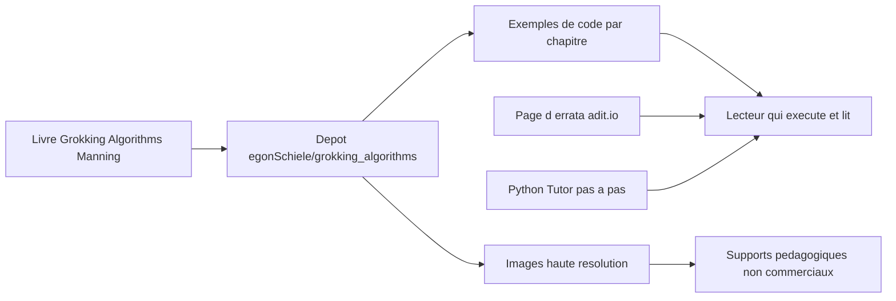

# egonSchiele/grokking_algorithms

> **The code and artwork from the book Grokking Algorithms, for anyone learning classic algorithms.**

## The problem

Reading an algorithms book without runnable code leaves the concepts abstract. Without this repository you would retype every example by hand, and the illustrations would stay locked inside the printed edition.

## What it actually does

The repository holds the code from Aditya Bhargava's book *Grokking Algorithms*, published by Manning. Per the README it also contains **every image from the book in high resolution**, usable for non-commercial purposes provided you credit "copyright Manning Publications, drawn by adit.io".

The README links to an errata page (adit.io/errata.html) and to Python Tutor, a site that walks through Python code line by line. It does not list the algorithms covered, the languages available, or the folder layout: GitHub reports JavaScript as the main language, yet the README explicitly welcomes contributions that add examples in new languages.

The author states that the point of the repository is examples that are **easy to read**: he declines pull requests bringing complex optimisations or purely stylistic edits, and welcomes error fixes, new languages and modernisations.

## How it is wired

There is no software pipeline here: this is a companion repository. The README describes three flows — the chapter code, the images under restricted usage terms, and the external resources (errata, Python Tutor) the reader is pointed to. No specific file is named in the README.

## Trying it

No command is documented in the README: no installation, no build, no test run. You clone the repository and open the files, or read them straight on GitHub. Writing any command here would mean inventing a procedure absent from the source.

## Cost and traps

Nothing to install, nothing to pay for the repository itself. The real cost sits elsewhere: the code only makes sense alongside the book, a commercial title sold by Manning. The main trap is that the **images are not freely reusable**: non-commercial use only, with mandatory copyright attribution. The GitHub licence field reads NOASSERTION, meaning it was not automatically identified — check it before any reuse. Finally, the author warns that he is slow to answer pull requests and prefers email over issues for questions.

## What it is not

It is neither a library to import nor a reference implementation for production: the examples are deliberately simplified to stay readable, and optimisations are explicitly refused. It is not the book either — without the text, the code loses its explanations. And it is not a set of royalty-free illustrations, despite the high-resolution images being available.

## Alternatives

No comparable alternative is named in the README, and no neighbours were supplied from the catalogue. The only third-party resource cited is **Python Tutor**, which is a complement rather than a competitor: it visualises step by step the execution of the Python code you are reading.

## For you

Useful mainly for brushing up fundamentals (sorting, search, graphs, dynamic programming) before an interview or for teaching. No direct contribution to a data, AI or MLOps stack: bookmark it, do not integrate it.
