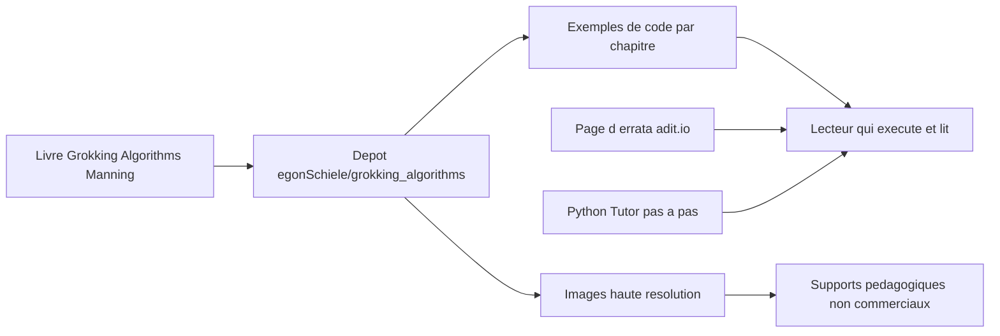

# egonSchiele/grokking_algorithms

> **Le code et les illustrations du livre Grokking Algorithms, pour qui apprend les algorithmes classiques.**

## Le problème

Lire un livre d'algorithmique sans pouvoir exécuter le code laisse les concepts abstraits. Sans ce dépôt, il faut retaper les exemples du livre à la main, et les illustrations restent enfermées dans la version papier.

## Ce que ça fait vraiment

Le dépôt rassemble le code du livre *Grokking Algorithms* d'Aditya Bhargava, publié chez Manning. Il contient aussi, d'après le README, **toutes les images du livre en haute résolution**, réutilisables en usage non commercial à condition de créditer « copyright Manning Publications, drawn by adit.io ».

Le README pointe vers une page d'errata (adit.io/errata.html) et vers Python Tutor, un site qui déroule du code Python ligne par ligne. Le README ne liste ni les algorithmes couverts, ni les langages présents, ni la structure des dossiers : la métadonnée GitHub indique JavaScript comme langage principal, mais le README revendique explicitement l'ajout d'exemples dans de nouveaux langages comme contribution bienvenue.

L'auteur précise que l'objectif du dépôt est d'avoir des exemples **faciles à lire** : il refuse en principe les PR d'optimisations complexes ou de pur style, et accepte volontiers les corrections d'erreurs, les nouveaux langages et les modernisations.

## Comment c'est branché

Il n'y a pas de chaîne logicielle : le dépôt est un dépôt d'accompagnement. Le README décrit trois flux — le code des chapitres, les images sous licence d'usage restreint, et les ressources externes (errata, Python Tutor) vers lesquelles le lecteur est renvoyé. Aucun fichier précis n'est nommé dans le README.

## Essayer

Aucune commande n'est documentée dans le README : pas d'installation, pas de build, pas de lancement de tests. On clone et on ouvre les fichiers, ou on les lit directement sur GitHub. Ne rien reconstruire ici serait inventer une procédure absente de la source.

## Coût et pièges

Rien à installer, rien à payer côté dépôt. Le vrai coût est ailleurs : le code n'a de sens qu'avec le livre, qui est un ouvrage commercial vendu par Manning. Piège principal, les **images ne sont pas librement réutilisables** : usage non commercial uniquement, avec mention de copyright obligatoire. La licence GitHub est déclarée NOASSERTION, c'est-à-dire non identifiée automatiquement — à vérifier avant tout réemploi. Enfin, l'auteur prévient lui-même que son délai de réponse aux PR est long, et renvoie les questions vers son email plutôt que vers les issues.

## Ce que ce n'est pas

Ce n'est ni une bibliothèque à importer, ni une implémentation de référence à mettre en production : les exemples sont volontairement simplifiés pour rester lisibles, et les optimisations sont explicitement refusées. Ce n'est pas non plus le livre : sans le texte, le code est privé de ses explications. Et ce n'est pas un jeu d'illustrations libres de droits, malgré la mise à disposition en haute résolution.

## Alternatives

Aucune alternative comparable n'est nommée dans le README ni fournie dans les voisins du catalogue. La seule ressource tierce citée est **Python Tutor**, qui n'est pas un concurrent mais un complément : il visualise l'exécution pas à pas du code Python qu'on lit ici.

## Pour toi

Intérêt limité au rafraîchissement des fondamentaux (tri, recherche, graphes, programmation dynamique) avant un entretien ou pour enseigner. Aucun apport direct à une chaîne data, IA ou MLOps : à garder en signet, pas à intégrer.
