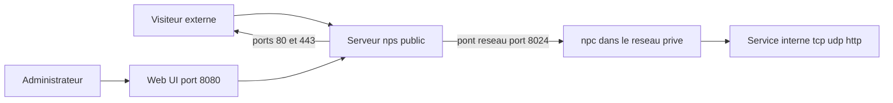

# ehang-io/nps

> **Reverse tunnel server driven by a web console, to expose machines sitting on a private network.**

## The problem

A machine behind NAT or a firewall cannot be reached from outside. The README frames this as
"intranet penetration": making services that run on a private host reachable through a public
server, without opening inbound ports on the client side.

## What it actually does

Per the README, nps handles tcp, udp, http(s), socks5, p2p and http proxy, on linux, windows,
macos and Synology, and can be installed as a system service. It advertises https conversion
of backend services with multiple certificates, display of traffic, real-time bandwidth,
system information and client version, plus cache, compression, encryption, traffic and
bandwidth limits, and port reuse. Domain handling covers custom headers, 404 page, host
rewriting, site protection, URL routing and wildcard resolution. The server supports multiple
users and user registration. Worth noting: the README leans on "powerful", "high-performance"
and "lightweight" with no figures behind them — that is a signal in itself.

## How it is wired



The README describes two separate binaries: `nps` on the server, `npc` on the client. The
default configuration uses ports 80 and 443 for host mode, 8080 for the web management
interface, and 8024 for the bridge between server and client. Tunnels are then configured from
the web UI once the client is connected. Internal module layout is not documented in the README.

## Trying it

Commands copied from the README. Download from the
[releases](https://github.com/ehang-io/nps/releases); server and client are separate packages.

```
sudo ./nps install     # linux, darwin
nps.exe install        # windows, cmd as administrator
sudo nps start
nps.exe start
```

Then browse to `server_IP:8080`, log in with `admin` / `123`, and create a client. The client
start command is copied from the web UI via the `+` sign (on Windows, replace `./npc` with
`npc.exe`). No fixed client command is given in the README: the UI generates it.

## Cost and traps

Free, but GPL-3.0: copyleft, which matters if the binary ships inside a product. The main trap
is stated in the README itself: the default `admin`/`123` credentials "must be modified when
officially used". Add a wide exposure surface — four default ports, including a web admin
console on 8080. Config files live in `C:\Program Files\nps` on Windows and `/etc/nps` on
linux/darwin, logs in the current directory or `/var/log/nps.log`. The README calls the
project "under development".

## What it is not

Not a VPN or a mesh network: you expose named services, not a whole network. Not a hosted
service — you need and must operate your own reachable public server. Not secure by default
either, given the trivial installation password and the exposed web console. Detailed
documentation lives on an external site, partly in Chinese, and the README says nothing about
actual performance, memory use or scaling limits.

## Alternatives

The README names no competitor. Among catalogue neighbours, go-gost/gost is the closest fit
(multi-protocol tunnels and relays in Go), while v2ray/v2ray-core and v2fly/v2ray-core are
about filtering circumvention rather than exposing internal services, and xjasonlyu/tun2socks
works at the tun interface level. None offers the equivalent of the web admin console here.

## For you

Useful when you need to make a demo, an API or a lab service reachable from a machine with no
public IP, and you prefer a web console to a config file. For anything exposed to the open
internet, changing the default password and restricting access to port 8080 are prerequisites,
not options.
