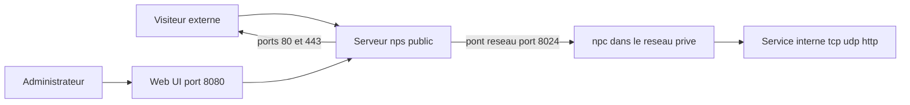

# ehang-io/nps

> **Serveur de tunnel inverse piloté par une interface web, pour exposer des machines d'un réseau interne.**

## Le problème

Une machine derrière un NAT ou un pare-feu n'est pas joignable depuis l'extérieur. Le README
pose le sujet comme de l'« intranet penetration » : rendre accessibles, depuis un serveur
public, des services qui tournent sur un poste ou un réseau privé, sans avoir à ouvrir de
ports côté client.

## Ce que ça fait vraiment

D'après le README, nps couvre tcp, udp, http(s), socks5, p2p et proxy http, sur linux,
windows, macos et Synology, avec installation en service système. Il annonce la conversion
de services backend en https avec certificats multiples, un affichage du trafic, de la bande
passante temps réel, des infos système et de la version du client, ainsi que du cache, de la
compression, du chiffrement, de la limitation de trafic et de bande passante, et de la
réutilisation de ports. Côté noms de domaine : en-têtes personnalisés, page 404, modification
de host, protection de site, routage d'URL et résolution générique. Le serveur gère plusieurs
utilisateurs et l'enregistrement. À noter : le README s'appuie beaucoup sur « powerful »,
« high-performance » et « lightweight » — ces qualificatifs ne sont étayés par aucun chiffre
dans le document, c'est en soi un signal.

## Comment c'est branché



Le README décrit deux binaires distincts : `nps` côté serveur, `npc` côté client. Le fichier
de configuration par défaut occupe les ports 80 et 443 pour le mode host, 8080 pour l'accès à
l'administration web et 8024 pour le pont réseau entre serveur et client. La configuration
des services à traverser se fait ensuite depuis l'interface web, une fois le client connecté.
Le détail interne des modules n'est pas documenté dans le README.

## Essayer

Commandes recopiées du README. Installation depuis les [releases](https://github.com/ehang-io/nps/releases),
serveur et client étant des paquets séparés. Installation du serveur :

```
sudo ./nps install     # linux, darwin
nps.exe install        # windows, cmd en administrateur
```

Démarrage :

```
sudo nps start         # linux, darwin
nps.exe start          # windows, cmd en administrateur
```

Puis accéder à `IP_du_serveur:8080`, se connecter avec `admin` / `123` et créer un client.
La commande de démarrage du client se copie depuis l'interface web via le signe `+` (sous
Windows, remplacer `./npc` par `npc.exe`). Le README ne fournit pas de commande de démarrage
client fixe : elle est générée par l'UI.

## Coût et pièges

Gratuit, mais sous GPL-3.0 : copyleft, à vérifier si le binaire est intégré à un produit.
Le piège principal est explicite dans le README : le couple `admin`/`123` par défaut, « must
be modified when officially used ». S'y ajoute une surface d'exposition large, avec quatre
ports par défaut dont une interface d'administration web sur 8080. Les fichiers de
configuration se trouvent dans `C:\Program Files\nps` sous Windows et `/etc/nps` sous
linux/darwin, les logs dans le répertoire courant ou `/var/log/nps.log`. Le README se qualifie
lui-même de « project under development ».

## Ce que ce n'est pas

Ce n'est pas un VPN ni un maillage réseau : on expose des services désignés, pas un réseau
entier. Ce n'est pas un service hébergé — il faut disposer d'un serveur public joignable et
l'administrer soi-même. Ce n'est pas non plus un outil sécurisé par défaut : mot de passe
trivial à l'installation et console web accessible. La documentation détaillée n'est pas dans
le dépôt mais sur un site externe, en partie en chinois, et le README ne dit rien des
performances réelles, de la consommation mémoire ni des limites de montée en charge.

## Alternatives

Le README ne cite aucun projet concurrent. Parmi les voisins du catalogue, go-gost/gost est
le plus proche fonctionnellement (tunnels et relais multi-protocoles en Go), tandis que
v2ray/v2ray-core et v2fly/v2ray-core relèvent plutôt du contournement de filtrage que de
l'exposition de services internes, et xjasonlyu/tun2socks agit au niveau d'une interface tun.
Aucun n'offre l'équivalent de la console web d'administration décrite ici.

## Pour toi

Utile si tu dois rendre joignable une démo, une API ou un service de labo qui tourne sur une
machine sans IP publique, et que tu préfères une console web à un fichier de configuration.
Pour un usage exposé sur Internet, changer le mot de passe par défaut et restreindre l'accès
au port 8080 sont des préalables, pas des options.
