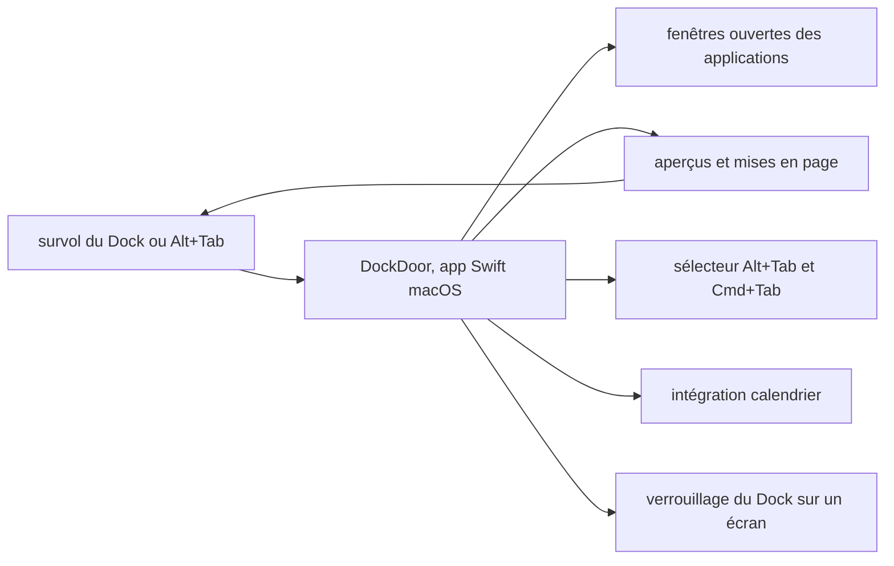

# ejbills/DockDoor

> **A macOS utility that shows and switches open windows when you hover a Dock icon.**

## The problem

On macOS, a Dock icon tells you nothing about how many windows an app has open, or which ones.
With three documents in the same editor you click first and hunt afterwards. The README states
that gap plainly: the native Dock "lacks context when multiple windows of the same application
are open".

## What it actually does

The README advertises window previews on hovering a Dock icon, letting you visualise, manage
and switch between open windows. On top of that: an Alt+Tab switcher, additions to the native
Cmd+Tab, several layouts for both previews and the window switcher, a compact list view,
enlarged previews and a calendar integration. Dock locking pins the Dock to one monitor so it
stops jumping between screens in multi-display setups. The README documents neither the internal
architecture, nor the system APIs used, nor the available settings: it points to dockdoor.net.
Worth noting: the description leans on unverifiable adjectives (fast, lightweight, "seamless"
integration) rather than on measurable facts — a signal in itself.

## How it is wired



The diagram is inferred from the README alone, since no code-derived diagram exists for this
repo and the README names no source file. The app sits between the user and the native Dock,
reads the state of open windows, and renders either a preview panel, an Alt+Tab-style switcher
or a list view, sent back to the screen on hover.

## Trying it

```
No install or build command is documented in the README.
The only described path is downloading the DockDoor.dmg file from the repository's
GitHub releases page (the "releases/latest/download/DockDoor.dmg" link).
```

The repo carries Swift and Xcode badges, which suggests building from source is possible, but
the README gives no procedure for it.

## Cost and traps

The app in this repo is free and the README states it will never have a paywall. The real cost
is elsewhere: a separate paid product, DockDoor Pro, $20 once for 3 Macs, sold by the same
developer and taking up a whole README section; most of the features shown in the "Pro"
screenshots do not belong to this repo. Implicit blocking requirement: macOS only. A utility
that reads every application's windows inherently needs accessibility and screen-recording
system permissions, which the README does not mention — check before installing. The declared
license on the API side is NOASSERTION while the README announces GPL v3.0: copyleft, hence
constraining if you reuse the code.

## What it is not

Not a Dock replacement: the README explicitly reserves that role for DockDoor Pro, a different,
paid piece of software. Not a library or reusable component: nothing is exposed for embedding
elsewhere. Not cross-platform, despite the claimed inspiration from Windows and Linux. And not
a documented tool: the real documentation lives on an external site, not in the repo.

## Alternatives

The README names no competing project and no catalogue neighbour is comparable: no comparable
alternative in the catalogue. The only points of comparison mentioned are the native macOS Dock,
whose lack of previews motivates the project, and DockDoor Pro by the same author, which covers
the same need in a paid and broader form.

## For you

Nothing to do with data, AI or MLOps: this is desktop comfort, useful day to day if you work on
macOS with many windows, with no technical value transferable to your projects. Keep it as a
personal tool, do not file it into the DevBrain.
