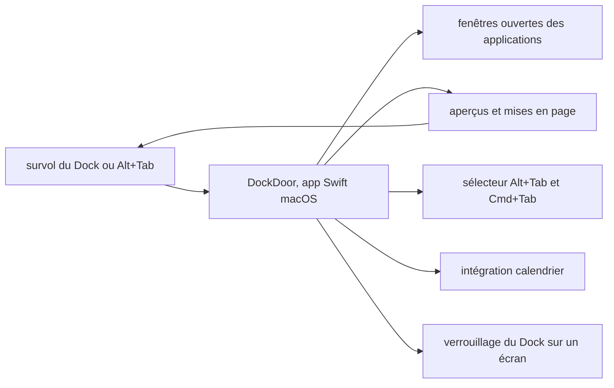

# ejbills/DockDoor

> **Utilitaire macOS qui montre et permet de choisir les fenêtres ouvertes au survol du Dock.**

## Le problème

Sur macOS, une icône du Dock ne dit pas combien de fenêtres l'application a ouvertes ni
lesquelles. Quand trois documents tournent dans le même éditeur, il faut cliquer puis fouiller.
Le README pose exactement ce manque : le Dock natif « manque de contexte quand plusieurs
fenêtres de la même application sont ouvertes ».

## Ce que ça fait vraiment

Le README annonce l'aperçu des fenêtres au survol d'une icône du Dock, avec possibilité de les
visualiser, les gérer et passer de l'une à l'autre. S'y ajoutent un basculement Alt+Tab, des
compléments au Cmd+Tab natif, plusieurs mises en page pour les aperçus comme pour le sélecteur
de fenêtres, une vue liste compacte, des aperçus agrandis et une intégration calendrier.
Le verrouillage du Dock l'épingle sur un moniteur donné pour qu'il cesse de sauter d'écran en
écran dans une configuration multi-affichage. Le README ne documente ni l'architecture interne,
ni les API système utilisées, ni les réglages disponibles : il renvoie à dockdoor.net.
À noter : la description repose largement sur des adjectifs non vérifiables (rapide, léger,
intégration « seamless ») plutôt que sur des faits mesurables — signal à garder en tête.

## Comment c'est branché



Le schéma est déduit du seul README, aucun diagramme tiré du code n'étant disponible pour ce
dépôt : le README ne nomme aucun fichier source. L'app s'interpose entre l'utilisateur et le
Dock natif, lit l'état des fenêtres ouvertes et rend selon le cas un panneau d'aperçus, un
sélecteur de type Alt+Tab ou une vue liste, le tout renvoyé à l'écran au survol.

## Essayer

```
Aucune commande d'installation ni de compilation n'est documentée dans le README.
Le seul chemin décrit est le téléchargement du fichier DockDoor.dmg depuis la page
des releases GitHub du dépôt (lien « releases/latest/download/DockDoor.dmg »).
```

Le dépôt affiche des badges Swift et Xcode, ce qui laisse supposer une compilation possible,
mais le README n'en donne pas la procédure.

## Coût et pièges

L'app de ce dépôt est gratuite et le README affirme qu'elle n'aura jamais de paywall. Le coût
réel est ailleurs : un produit séparé et payant, DockDoor Pro, 20 $ une fois pour 3 Macs, est
vendu par le même développeur et occupe une section entière du README ; la majorité des
fonctions mises en avant sur les captures « Pro » n'appartiennent pas à ce dépôt. Prérequis
implicite et bloquant : macOS uniquement. Un utilitaire qui lit les fenêtres de toutes les
applications réclame par nature des autorisations système d'accessibilité et d'enregistrement
d'écran, que le README ne mentionne pas — à vérifier avant installation. La licence déclarée
côté API est NOASSERTION alors que le README annonce GPL v3.0 : copyleft, donc contraignant en
cas de réutilisation de code.

## Ce que ce n'est pas

Ce n'est pas un remplaçant du Dock : le README réserve explicitement ce rôle à DockDoor Pro,
qui est un autre logiciel, payant. Ce n'est pas une bibliothèque ni un composant réutilisable :
rien n'est exposé pour être intégré ailleurs. Ce n'est pas multiplateforme malgré l'inspiration
revendiquée de Windows et Linux. Et ce n'est pas un outil documenté : la documentation réelle
vit sur un site externe, pas dans le dépôt.

## Alternatives

Le README ne nomme aucun projet concurrent et aucun voisin de catalogue n'est comparable :
aucune alternative comparable dans le catalogue. Le seul point de comparaison cité est le Dock
macOS natif, dont l'absence d'aperçus motive le projet, et DockDoor Pro du même auteur, qui
couvre le même besoin en version payante et plus large.

## Pour toi

Aucun rapport avec la data, l'IA ou le MLOps : c'est un confort de poste de travail, utile au
quotidien si tu travailles sur macOS avec beaucoup de fenêtres, sans valeur technique
transférable à tes projets. À garder sous le coude comme outil perso, pas à verser au DevBrain.
