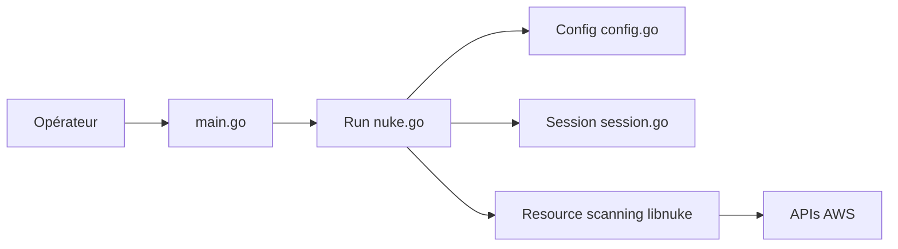

# ekristen/aws-nuke

> CLI Go qui supprime toutes les ressources d'un compte AWS, pour nettoyer les comptes de test.

## Le problème
Les comptes AWS de sandbox accumulent des ressources oubliées qui coûtent de l'argent et sont longues à supprimer à la main.

## Ce que ça fait vraiment
Charge une config et des identifiants, identifie le compte et les régions, scanne les types de ressources enregistrés, puis supprime ce que les filtres n'excluent pas, après confirmation ou en dry-run. Fork réécrit de rebuy-de/aws-nuke autour de la bibliothèque libnuke. Commandes d'explication de compte/config et de listage de ressources. Couverture AWS incomplète, de l'aveu du README.

## Comment c'est branché


## Essayer
```bash
brew install ekristen/tap/aws-nuke@3
```
Le README renvoie à la documentation en ligne pour la config ; la sous-commande `run` (alias `nuke`) remplace l'ancienne racine.

## Coût et pièges
Gratuit, mais destructif : une mauvaise config ou un mauvais compte efface tout. Les ressources non couvertes restent. 135 issues ouvertes.

## Ce que ce n'est pas
Pas un outil de gouvernance continue : il supprime, il ne protège pas. Pas encore le SDK Go v2.

## Alternatives
rebuy-de/aws-nuke, le projet d'origine dont celui-ci est le fork, mis à jour plus lentement selon l'auteur.

## Pour toi
À adopter pour les comptes sandbox ML : il évite des factures oubliées (GPU, volumes) ; l'utiliser avec filtres et dry-run.

