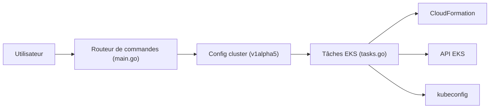

# eksctl-io/eksctl

> CLI officielle pour créer et gérer des clusters Amazon EKS, pour équipes d'infrastructure sur AWS.

## Le problème
Monter un cluster EKS à la main (VPC, rôles IAM, groupes de nœuds) est long et sujet aux erreurs.

## Ce que ça fait vraiment
`eksctl create cluster` produit un cluster en quelques minutes via CloudFormation, avec des valeurs par défaut (2 nœuds m5.large, région us-west-2, VPC dédié, AMI EKS officielle) et écrit les accès dans `~/.kube/config`. Il gère aussi groupes de nœuds, addons, mode Auto, entrées d'accès, pod identity et un contrôleur VPC. Écrit en Go.

## Comment c'est branché


## Essayer
```bash
curl -sLO "https://github.com/eksctl-io/eksctl/releases/latest/download/eksctl_$PLATFORM.tar.gz"
docker run --rm -it public.ecr.aws/eksctl/eksctl version
eksctl create cluster
```

## Coût et pièges
Identifiants AWS et droits IAM étendus nécessaires ; les ressources créées (EC2, EKS, VPC) sont facturées par AWS. Surveiller les quotas VPC. Licence présente mais non identifiée par GitHub.

## Ce que ce n'est pas
Pas un outil multi-cloud, et pas un gestionnaire de déploiement d'applications : il provisionne le cluster. Les installateurs tiers (Homebrew, Chocolatey…) ne sont pas supportés par AWS.

## Alternatives
Non documenté dans le README : aucune alternative nommée (Terraform est cité comme autre outil lisant les identifiants).

## Pour toi
À adopter si tes charges MLOps tournent sur EKS : c'est la voie la plus directe pour un cluster de test ; vérifie la licence, et le coût AWS du cluster laissé allumé.

