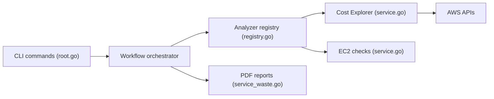

# elC0mpa/aws-doctor

> Outil en ligne de commande qui contrôle la santé d'un compte AWS : coûts, tendances, ressources inutilisées.

## Le problème
La console AWS montre la facture brute sans dire si on dépense efficacement ni quoi nettoyer.

## Ce que ça fait vraiment
Compare des mois sur des fenêtres identiques, trace six mois de tendance, repère le gaspillage (IP élastiques, instances arrêtées ou inactives, snapshots orphelins, RDS, NAT, load balancers, Lambda surdimensionnées, endpoints SageMaker, ECR, secrets, IAM). Sortie table, JSON, CSV ou rapport PDF.

## Comment c'est branché


## Essayer
```bash
brew install elC0mpa/homebrew-tap/aws-doctor
go install github.com/elC0mpa/aws-doctor@latest
aws-doctor waste ec2 s3 lambda
aws-doctor report cost
aws-doctor report waste --path ./billing-analysis.pdf
```

## Coût et pièges
Identifiants AWS avec droits de lecture (Cost Explorer, `pricing:GetProducts` pour les tarifs régionaux, sinon valeurs par défaut). Les appels Cost Explorer peuvent être facturés par AWS ; le README ne chiffre pas.

## Ce que ce n'est pas
Pas un remplacement complet de Trusted Advisor ; il diagnostique, il ne corrige pas. Vérifie les estimations de coût.

## Alternatives
AWS Trusted Advisor (payant), cité comme ce qu'il remplace gratuitement.

## Pour toi
À adopter : un profil MLOps qui paie des GPU et SageMaker y trouve vite les ressources oubliées, sans coût de licence.

