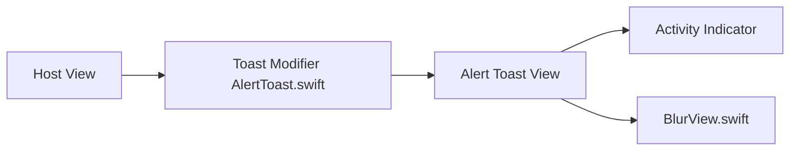

# elai950/AlertToast

> Bibliothèque SwiftUI pour afficher des alertes et toasts sans action de l'utilisateur.

## Le problème
SwiftUI n'offre que `Alert` : l'utilisateur doit appuyer sur OK pour chaque information.

## Ce que ça fait vraiment
Un modificateur `.toast` affiche des fenêtres éphémères en trois modes (alerte au centre, HUD par le haut, bannière par le bas), avec types texte, validation, erreur, image système, image et chargement. Mode clair/sombre, localisation, personnalisation de police et de fond. iOS 13+ et macOS 11+.

## Comment c'est branché


## Essayer
```ruby
pod 'AlertToast'
```
```swift
.toast(isPresenting: $showToast){
    AlertToast(type: .regular, title: "Message Sent!")
}
```

## Coût et pièges
Gratuit. Dernier push en novembre 2024. Le README affiche une adresse de don cryptomonnaie ambiguë (réseau BNB, intitulé BTC) : prudence.

## Ce que ce n'est pas
Pas multiplateforme hors Apple. Pas de notifications système.

## Alternatives
Aucune alternative nommée dans le README.

## Pour toi
À ignorer : bibliothèque d'interface iOS/macOS sans rapport avec data, IA ou MLOps, et peu active depuis fin 2024.

