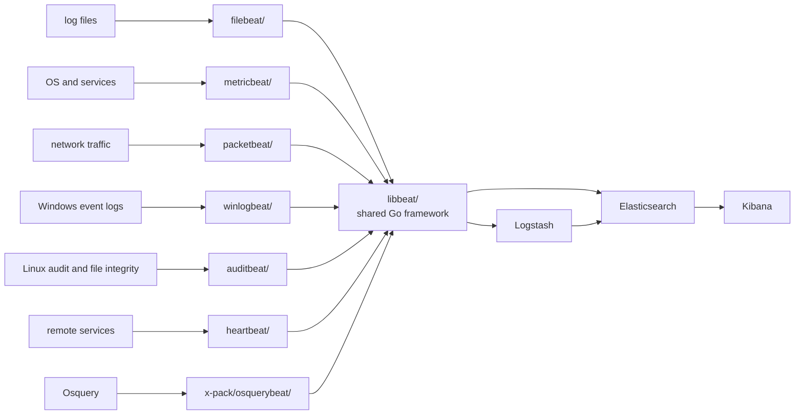

# elastic/beats

> **Go agents installed on servers to ship logs, metrics and packets into Elasticsearch.**

## The problem

Gathering what happens across a fleet — growing log files, system metrics, Windows event logs,
network traffic — means either one heavy agent per source or homemade scripts to maintain on every
host. Each source speaks its own format before it ever reaches a search engine.

## What it actually does

The repository holds `libbeat`, the Go framework for building shippers, plus the officially
supported Beats built on it. Each covers one source: `filebeat` tails and ships log files,
`metricbeat` fetches sets of metrics from the operating system and services, `packetbeat` monitors
the network by sniffing packets, `winlogbeat` fetches Windows Event logs, `auditbeat` collects
Linux audit framework data and monitors file integrity, `heartbeat` pings remote services for
availability, and `osquerybeat` (under `x-pack/`) runs Osquery and manages the interaction.

The destination is deliberately single: Elasticsearch, directly or via Logstash, for visualisation
in Kibana. "Lightweight" here means three stated things — small installation footprint, limited
system resources, no runtime dependencies. `libbeat` also lets the community write its own Beats
outside this repository.

## How it is wired



No code-derived diagram ships with this repository: the graph above is rebuilt from the README
alone, using the directory names it cites.

## Trying it

The README documents **no install or run commands**. It points to the per-Beat getting-started
guides on `elastic.co/guide`, to pre-compiled binaries and packages on `elastic.co/downloads/beats`,
and to `CONTRIBUTING.md` for building from source. Its only literal commands are CI triggers posted
as GitHub pull-request comments, available to Elastic-affiliated users only:

```bash
# comment on a GitHub PR — beats pipeline (buildkite.com/elastic/beats)
/test

# comment on a GitHub PR — docs pipeline
run docs-build
```

## Cost and gotchas

- **No API key, no GPU, no mandatory Docker** per the README; agents install as binaries or system
  packages.
- **The cost sits downstream**: a Beat is only useful with an Elasticsearch (usually Kibana, often
  Logstash) to feed. That stack — hosted or self-managed — carries the storage, operations and any
  bill. The README gives no figures.
- **Licence recorded as `NOASSERTION`** by the catalogue: the README declares none, and the repo
  contains an `x-pack/` tree (including `osquerybeat`) traditionally under separate terms. Check the
  licence files before internal use — that is the alert.
- **Snapshot builds** of `8.0-SNAPSHOT` are built on top of `main` and, the README says, are not
  meant for production.
- **Asymmetric support**: PR-comment CI triggers are closed to outside contributors, and GitHub
  tickets are reserved for confirmed bugs; everything else goes to `discuss.elastic.co`.

## What it is not

- **Not a vendor-agnostic collector.** Everything converges on Elasticsearch, directly or through
  Logstash. Outside that stack the value collapses; this is not OpenTelemetry.
- **Not one program** but seven distinct agents sharing `libbeat`: you deploy and configure one per
  data type, not a single service.
- **Not the path Elastic currently pushes**: the README devotes a separate section to the Elastic
  Agent and its docs, without saying which one to pick.

## Alternatives

| | When to prefer it |
|---|---|
| **Elastic Agent** | Named in the README with its own section and download page. Prefer it for a single, centrally managed agent instead of seven binaries configured separately. Prefer Beats for one source, a minimal footprint and no runtime dependencies. |
| **Logstash** | Cited as an optional hop before Elasticsearch. Prefer it when events must be transformed, enriched or routed; Beats only ship. |
| **Community Beats (`libbeat`)** | The README links a list of third-party Beats built on `libbeat` outside this repo. Prefer them when your source is covered by none of the seven official agents — writing your own included. |

No neighbours were supplied with this repository: these three come from the README alone.

## For you

Useful if your observability stack is already Elastic: `metricbeat` and `filebeat` are the shortest
route to instrumenting training or serving hosts without writing a collector. Watch rather than
adopt blindly — the licence is undeclared, and the README promotes the Elastic Agent alongside
without choosing. Before putting seven agents on a fleet, decide which of the two you are tooling.
