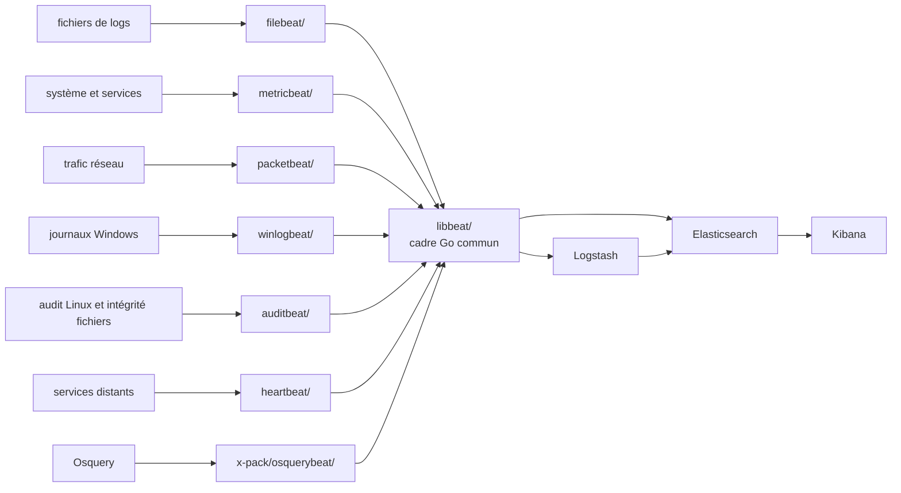

# elastic/beats

> **Agents Go posés sur les serveurs pour expédier logs, métriques et paquets vers Elasticsearch.**

## Le problème

Récolter ce qui se passe sur une flotte de machines — fichiers de logs qui grossissent, métriques
système, journaux d'événements Windows, trafic réseau — suppose soit un agent lourd par source,
soit des scripts maison à maintenir sur chaque hôte. Et chaque source parle un format différent
avant même d'arriver dans un moteur de recherche.

## Ce que ça fait vraiment

Le dépôt réunit `libbeat`, le cadre Go de création d'agents, et les agents officiels construits
dessus. Chacun couvre une source : `filebeat` suit les fichiers de logs et les expédie,
`metricbeat` récupère des jeux de métriques du système d'exploitation et des services,
`packetbeat` écoute le réseau en reniflant les paquets, `winlogbeat` remonte les journaux
d'événements Windows, `auditbeat` collecte les données du cadre d'audit Linux et surveille
l'intégrité des fichiers, `heartbeat` pingue des services distants pour vérifier leur
disponibilité, `osquerybeat` (dans `x-pack/`) exécute Osquery et pilote l'échange avec lui.

La destination est unique et assumée : Elasticsearch, directement ou via Logstash, pour
visualisation dans Kibana. « Léger » au sens du README veut dire trois choses précises :
faible empreinte d'installation, consommation système limitée, aucune dépendance d'exécution.
`libbeat` sert aussi à la communauté pour écrire ses propres Beats hors de ce dépôt.

## Comment c'est branché



Aucun diagramme tiré du code n'accompagne ce dépôt : ce schéma est reconstruit depuis le seul
README, avec les noms de répertoires qu'il cite.

## Essayer

Le README ne documente **aucune commande d'installation ni de lancement** : il renvoie aux guides
de prise en main sur `elastic.co/guide` par Beat, aux binaires pré-compilés et paquets de
`elastic.co/downloads/beats`, et à `CONTRIBUTING.md` pour construire depuis les sources. Les
seules commandes littérales du README sont des déclencheurs de CI, à poster en commentaire d'une
pull request, réservés aux personnes affiliées à Elastic :

```bash
# commentaire sur une PR GitHub — pipeline beats (buildkite.com/elastic/beats)
/test

# commentaire sur une PR GitHub — pipeline de documentation
run docs-build
```

## Coût et pièges

- **Pas de clé d'API, pas de GPU, pas de Docker exigé** par le README ; les agents se posent en
  binaires ou paquets système.
- **Le coût est en aval** : un Beat n'a d'intérêt qu'avec un Elasticsearch (et souvent Kibana,
  parfois Logstash) à alimenter. C'est cette pile — hébergée ou auto-gérée — qui porte la charge
  de stockage, d'exploitation et la facture éventuelle. Le README ne chiffre rien.
- **Licence relevée `NOASSERTION`** par le catalogue : le README n'annonce pas de licence et le
  dépôt contient une partie `x-pack/` (dont `osquerybeat`), traditionnellement sous conditions
  distinctes. À lever sur les fichiers de licence avant tout usage interne — c'est l'alerte.
- **Instantanés de test** : les builds `8.0-SNAPSHOT` publiés sont construits sur `main` et le
  README écrit qu'ils ne sont pas destinés à la production.
- **Support asymétrique** : les déclencheurs de CI par commentaire ne sont pas ouverts aux
  contributeurs externes, et les tickets GitHub sont réservés aux bugs confirmés — le reste passe
  par les forums `discuss.elastic.co`.

## Ce que ce n'est pas

- **Ce n'est pas un collecteur agnostique.** Tout converge vers Elasticsearch, directement ou via
  Logstash. Hors de cette pile, l'intérêt s'effondre : ce n'est pas un OpenTelemetry.
- **Ce n'est pas un seul programme** mais sept agents distincts partageant `libbeat` ; on en
  déploie et configure un par type de donnée, pas un unique service.
- **Ce n'est pas la voie que pousse Elastic aujourd'hui** : le README consacre une section
  séparée à l'Elastic Agent et à sa documentation, sans dire lequel choisir.

## Alternatives

| | Quand le préférer |
|---|---|
| **Elastic Agent** | Nommé dans le README avec sa propre section et sa page de téléchargement. À préférer pour un agent unique, piloté centralement, plutôt que sept binaires à configurer séparément. Beats à préférer quand on veut une seule source, une empreinte minimale et aucune dépendance d'exécution. |
| **Logstash** | Cité comme étape intermédiaire possible avant Elasticsearch. À préférer quand il faut transformer, enrichir ou router les événements ; les Beats se contentent d'expédier. |
| **Beats communautaires (`libbeat`)** | Le README renvoie à une liste de Beats tiers bâtis sur `libbeat`, hors de ce dépôt. À préférer quand la source à collecter n'est couverte par aucun des sept agents officiels — quitte à écrire le sien. |

Aucun voisin n'a été fourni avec ce dépôt : ces trois pistes viennent uniquement du README.

## Pour toi

Utile si la pile d'observabilité est déjà Elastic : `metricbeat` et `filebeat` sont le chemin le
plus court pour instrumenter des serveurs d'entraînement ou de service sans écrire de collecteur.
À surveiller plutôt qu'à adopter les yeux fermés : la licence n'est pas déclarée, et le README
met en avant l'Elastic Agent à côté sans trancher — avant d'en poser sept sur une flotte, il faut
savoir lequel des deux on outille.
