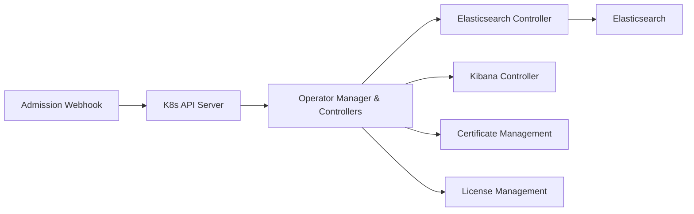

# elastic/cloud-on-k8s

> Opérateur Kubernetes qui déploie et gère la pile Elastic (Elasticsearch, Kibana, Beats, Logstash…).

## Le problème
Faire tourner un cluster Elasticsearch sur Kubernetes à la main : certificats, changements de topologie, volumes, mises à jour sans perte.

## Ce que ça fait vraiment
Un opérateur (modèle controller/reconcile) observe des CRD et crée les ressources Kubernetes pour Elasticsearch, Kibana, APM Server, Enterprise Search, Beats, Elastic Agent, Maps Server, Logstash. Il gère les certificats TLS, les changements de configuration sûrs, les volumes persistants, le keystore de secrets. Versions supportées : Kubernetes 1.32–1.36, OpenShift 4.16–4.22.

## Comment c'est branché

## Essayer
Le README renvoie au Quickstart de la documentation ; aucune commande n'y figure.

## Coût et pièges
Il faut un cluster Kubernetes. La licence GitHub n'est pas identifiée ; la gestion des licences Elastic est un module à part : vérifier ce qui est payant.

## Ce que ce n'est pas
Ce n'est pas Elasticsearch lui-même ni un service géré : c'est l'automatisation autour. 496 issues ouvertes.

## Alternatives
Aucune alternative nommée dans le README.

## Pour toi
À surveiller : utile si tu exploites Elasticsearch (recherche, RAG) sur Kubernetes ; sinon hors sujet.
