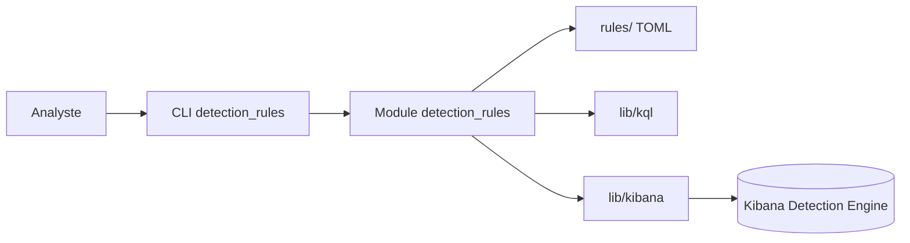

# elastic/detection-rules

> Règles de détection d'Elastic Security et outils Python pour les écrire, valider et publier.

## Le problème
Maintenir des règles de détection à la main, sans tests ni validation de schéma, produit des règles fausses ou incohérentes.

## Ce que ça fait vraiment
Le dépôt contient les règles au format TOML (`rules/`, `rules_building_block/`), des requêtes de chasse aux menaces (`hunting/`), un module Python `detection_rules` (parsing, validation, empaquetage, CLI) et deux bibliothèques `kibana` et `kql`. La CLI crée, teste, importe et exporte des règles et dialogue avec Kibana et Elasticsearch, dans une logique « détections as code ». Les automatisations d'attaque (RTA) sont dans un dépôt séparé, Cortado.

## Comment c'est branché


## Essayer
```bash
make
pip3 install ".[dev]"
python -m detection_rules --help
pip3 install lib/kibana lib/kql
```

## Coût et pièges
Python 3.12+. `kibana` et `kql` ne sont pas sur PyPI. Les règles servent surtout avec Elastic Security ; contribuer exige un accord de licence de contributeur (CLA).

## Ce que ce n'est pas
Tout le dépôt est sous Elastic License v2, licence non reconnue comme open source classique : elle est prévue pour un usage dans le Detection Engine d'Elastic. Ce n'est pas un SIEM.

## Alternatives
Aucune alternative nommée dans le README.

## Pour toi
À surveiller : bon exemple de « detection as code » testé, mais la licence ELv2 limite les usages hors Elastic.

