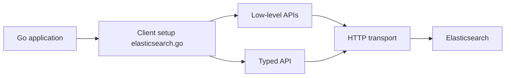

# elastic/go-elasticsearch

> Client Go officiel d'Elasticsearch, avec API bas niveau, API typée et helpers d'indexation en masse.

## Le problème
Interroger et alimenter Elasticsearch depuis Go sans construire les requêtes HTTP à la main.

## Ce que ça fait vraiment
Fournit un client configurable, une API bas niveau et une API typée avec builders de requêtes (`esdsl`). Le paquet `esutil` offre `JSONReader` et `BulkIndexer`. Gère intercepteurs et observabilité. Plusieurs versions majeures peuvent coexister dans un même projet.

## Comment c'est branché


## Essayer
```bash
go get github.com/elastic/go-elasticsearch/v9
```
Le README fourni renvoie à la documentation pour l'installation et la connexion.

## Coût et pièges
Gratuit ; un cluster Elasticsearch (ou Elastic Cloud) est nécessaire. Inclure le suffixe de version majeure (`/v8`, `/v9`) dans l'import.

## Ce que ce n'est pas
Ce n'est pas Elasticsearch ni un ORM : c'est un client.

## Alternatives
Aucune alternative nommée dans le README.

## Pour toi
À adopter si tu indexes ou cherches des données depuis Go : client officiel, maintenu par Elastic.

