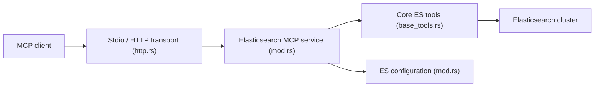

# elastic/mcp-server-elasticsearch

> Serveur MCP Rust, désormais déprécié, qui relie des agents IA à des index Elasticsearch.

## Le problème
Interroger Elasticsearch en langage naturel depuis un agent sans écrire d'API sur mesure.

## Ce que ça fait vraiment
Expose via stdio ou HTTP streamable cinq outils : list_indices, get_mappings, search (query DSL), esql et get_shards. Image Docker fournie par AWS Marketplace, authentification par clé d'API ou identifiant et mot de passe. Un point /ping sert de contrôle de santé.

## Comment c'est branché


## Essayer
```bash
docker run -i --rm -e ES_URL -e ES_API_KEY docker.elastic.co/mcp/elasticsearch stdio
```

## Coût et pièges
Gratuit, mais le dépôt est déprécié et ne reçoit que des correctifs de sécurité critiques. Il faut un cluster Elasticsearch 8.x ou 9.x. L'option ES_SSL_SKIP_VERIFY est à éviter hors tests.

## Ce que ce n'est pas
Ce n'est plus la voie recommandée : le README le dit remplacé par l'endpoint MCP d'Elastic Agent Builder (Elastic 9.2.0+ et Serverless). Aucune écriture dans les index n'est annoncée.

## Alternatives
Elastic Agent Builder MCP endpoint, indiqué comme successeur dans le README.

## Pour toi
À ignorer : déprécié par son éditeur ; utilise l'endpoint Agent Builder si tu es sur une version récente d'Elastic.

