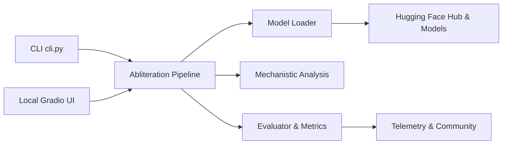

# elder-plinius/OBLITERATUS

> Boîte à outils qui localise et retire les comportements de refus des LLM (« abliteration »).

## Le problème
Selon l'auteur, les refus intégrés aux modèles bloquent aussi recherche, écriture et red-teaming ; les chercheurs veulent étudier où ces refus sont encodés.

## Ce que ça fait vraiment
Pipeline en six étapes : charger le modèle, collecter les activations sur prompts refusés et acceptés, extraire des directions de refus (diff-in-means, SVD, SVD blanchie), les projeter hors des poids, vérifier perplexité et cohérence, sauvegarder. Variante réversible par vecteurs de pilotage à l'inférence. S'ajoutent 15 modules d'analyse, des études d'ablation (couches, têtes, FFN) et une interface Gradio.

## Comment c'est branché


## Essayer
```bash
pip install -e .
obliteratus obliterate meta-llama/Llama-3.1-8B-Instruct --method advanced
obliteratus ui
obliteratus gpu-calc meta-llama/Llama-3.1-70B-Instruct --gpu-mem 24
pytest
```

## Coût et pièges
Gratuit ; GPU nécessaire au-delà des petits modèles. Télémétrie activée par défaut sur l'espace Hugging Face. AGPL-3.0.

## Ce que ce n'est pas
Pas un outil neutre : il produit des modèles sans garde-fous de sécurité, et tu es seul responsable de leurs sorties. Le README est très promotionnel et s'autoproclame « le plus avancé ».

## Alternatives
- TransformerLens : patching d'activations réel pour l'interprétabilité.
- Heretic : abliteration optimisée par Optuna.
- RepEng, SAELens : vecteurs de pilotage et autoencodeurs parcimonieux.

## Pour toi
À ignorer : retirer les garde-fous d'un modèle sort du cadre d'un usage data/MLOps en entreprise et crée un risque juridique et de conformité ; pour l'interprétabilité, TransformerLens ou SAELens répondent mieux.
