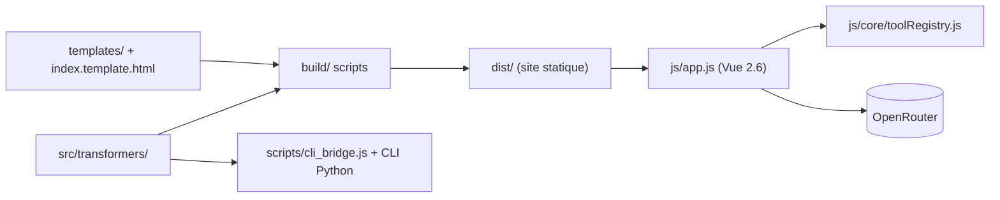

# elder-plinius/P4RS3LT0NGV3

> Application web statique de transformation de texte (222 transformations, stéganographie) avec outils optionnels via OpenRouter.

## Le problème
Encoder, décoder, chiffrer ou styliser du texte demande d'enchaîner de nombreux petits outils dispersés. Ici tout est regroupé dans une seule interface.

## Ce que ça fait vraiment
Applique 222 transformations (encodages, chiffres classiques, styles Unicode, alphabets fantaisie), décode automatiquement par heuristique, cache du texte dans des emojis ou des caractères invisibles, et offre un tokenizer (BPE GPT). Les onglets PromptCraft, Anti-Classifier et Traduction appellent des modèles via OpenRouter avec ta clé.

## Comment c'est branché


## Essayer
```bash
npm install
npm run build
npm start
npm test
uv run p4rs3lt0ngv3-cli encode --transform base64 --text "Hello World"
```

## Coût et pièges
Le cœur fonctionne hors ligne. Les outils IA exigent un compte OpenRouter et des crédits pour les modèles de pointe ; la clé est stockée dans le navigateur. `dist/` n'est pas versionné : il faut compiler après chaque clone.

## Ce que ce n'est pas
Ce n'est pas un outil de sécurité éprouvé : les chiffres classiques n'offrent aucune protection réelle. Les outils « Anti-Classifier » et « PromptCraft » servent à réécrire des prompts pour des tests de robustesse ; le README ne détaille pas d'évaluation.

## Alternatives
Le README ne cite aucune alternative.

## Pour toi
À surveiller : utile pour tester encodages et tokenisation de prompts, mais AGPL, mainteneur unique et périmètre fourre-tout limitent un usage MLOps sérieux.

