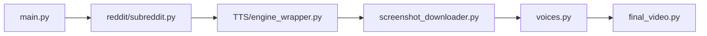

# elebumm/RedditVideoMakerBot

> Script Python qui transforme un fil Reddit en vidéo courte avec voix de synthèse.

## Le problème
Produire à la main des vidéos courtes tirées de Reddit demande montage et collecte de ressources.

## Ce que ça fait vraiment
`main.py` récupère un fil via l'API Reddit, synthétise la voix avec un fournisseur TTS (GTTS, AWS Polly, ElevenLabs, pyttsx, TikTok, Streamlabs Polly), capture des captures d'écran avec Playwright, puis assemble la vidéo avec un fond et ffmpeg. Le README précise qu'il ne téléverse rien : le fichier est à publier à la main.

## Comment c'est branché


## Essayer
```bash
git clone https://github.com/elebumm/RedditVideoMakerBot.git
cd RedditVideoMakerBot
python3 -m venv ./venv
source ./venv/bin/activate
pip install -r requirements.txt
python -m playwright install
python -m playwright install-deps
python main.py
```

## Coût et pièges
Il faut créer une application Reddit de type « script ». Certains fournisseurs TTS (AWS Polly, ElevenLabs) supposent un compte, non détaillé dans le README. Licence GPL-3.0.

## Ce que ce n'est pas
Pas un outil de publication ni de montage. L'installation par script `curl | bash` est marquée expérimentale.

## Alternatives
Aucune alternative nommée dans le README.

## Pour toi
Ignorer : automatisation de contenu hors périmètre data/IA/MLOps, et copyleft GPL-3.0 à considérer si tu voulais l'intégrer.

