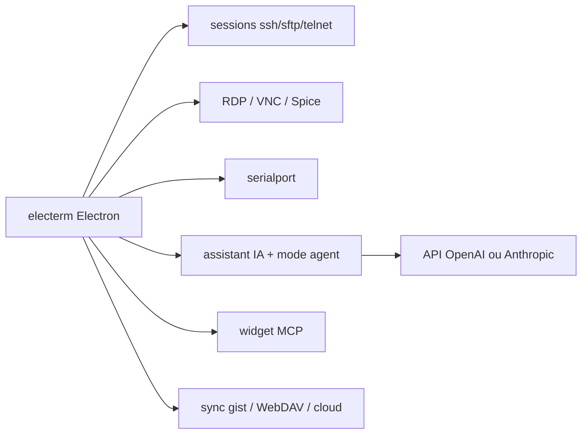

# electerm/electerm

> Terminal et client SSH/SFTP/FTP/telnet/série/RDP/VNC/Spice multiplateforme.

## Le problème
Jongler entre un terminal, un client SFTP et un client RDP séparés, sur des postes
et des architectures qu'aucun de ces outils ne couvre tous.

## Ce que ça fait vraiment
Terminal et gestionnaire de fichiers dans la même application. Couverture matérielle
inhabituelle : Windows 7+ (x64/ARM64), macOS 10.15+, Linux x64/arm64/riscv64/ppc64le
et LoongArch (ancien et nouveau monde), glibc 2.17+ pour UOS, Kylin, Ubuntu 18.04,
plus HarmonyOS, Android et iOS. Toutes les méthodes d'auth : clé publique, mot de
passe, agent SSH, certificats, OTP, netbird. Zmodem (rz/sz) et Trzsz (trz/tsz),
tunnels SSH et rebond de connexion. Raccourci global pour afficher/masquer la
fenêtre, thèmes et image de fond, proxy global ou par session, commandes rapides et
déclencheurs, saisie miroir vers un ou tous les terminaux, synchronisation des
favoris vers gist GitHub/Gitee, WebDAV, serveur custom ou cloud electerm. Assistant
IA intégré (formats OpenAI Chat Completions, OpenAI Responses, Anthropic Messages)
avec mode agent, et un widget MCP. Quatorze langues.

## Comment c'est branché


## Essayer
```bash
brew install --cask electerm
sudo snap install electerm --classic
winget install electerm.electerm
npm i -g electerm
```

## Coût et pièges
Gratuit. L'assistant IA et le mode agent supposent votre propre clé d'API. La
synchronisation des favoris via gist secret ou WebDAV expose des données de
connexion hors du poste — à cadrer. Un mode agent qui fait des opérations terminal
directement mérite prudence sur des serveurs de production.

## Ce que ce n'est pas
Pas un multiplexeur type tmux ni un outil de gestion de parc. Le dépôt est porté par
une personne (contact unique dans le README), pour une surface fonctionnelle très
large — la profondeur de test sur chaque plateforme exotique est difficile à juger.

## Alternatives
- Aucun dépôt alternatif nommé dans le README.

## Pour toi
Candidat sérieux si tu veux un seul client pour SSH, SFTP et RDP ; le mode agent
IA est le bonus à évaluer prudemment.
