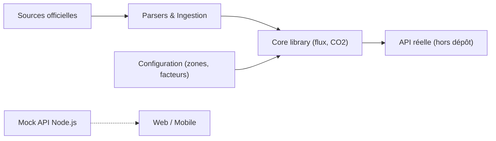

# electricitymaps/electricitymaps-contrib

> Collection de parseurs Python qui standardisent production, échanges et prix d'électricité par pays.

## Le problème
Les données de réseau électrique sont publiées dans des formats disparates par chaque gestionnaire de réseau.

## Ce que ça fait vraiment
Modules Python qui récupèrent des données publiques officielles (TSO, gouvernements) et les normalisent. Configuration en YAML/JSON (zones, échanges, facteurs d'émission, capacités). Le dépôt contient aussi un serveur factice Node.js et une appli mobile ; le front de carte web a été réécrit et retiré du dépôt.

## Comment c'est branché


## Essayer
```bash
# Aucune commande dans le README ; consulter la documentation liée.
```

## Coût et pièges
Gratuit ; l'accès à l'API et aux jeux historiques passe par le portail de la société (conditions non détaillées ici).

## Ce que ce n'est pas
Pas l'application complète : le front et le backend de production ne sont pas dans ce dépôt. AGPL-3.0 : copyleft réseau.

## Alternatives
- Portail de données Electricity Maps : jeux historiques déjà agrégés.

## Pour toi
À surveiller : source utile de données d'intensité carbone pour projets data/énergie, mais le service complet reste propriétaire.

