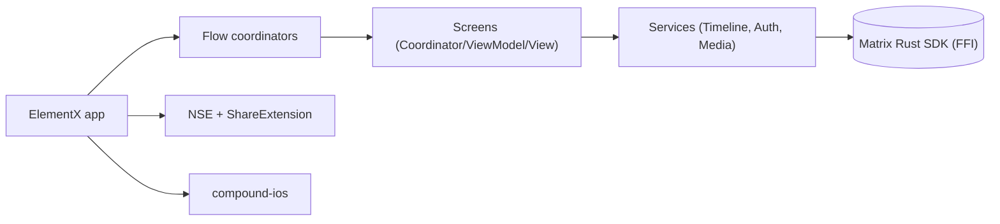

# element-hq/element-x-ios

> Client iOS Matrix de nouvelle génération d'Element, réécrit sur le SDK Rust, pour utilisateurs iOS 18+.

## Le problème
Il faut un client de messagerie Matrix natif, qui partage sa logique protocolaire avec les autres plateformes plutôt que de la réécrire.

## Ce que ça fait vraiment
Une app SwiftUI organisée en coordinateurs, view models et écrans, qui délègue le protocole Matrix au Matrix Rust SDK via un paquet Swift FFI. Elle couvre authentification (OAuth, QR), salons, espaces, chronologie, notifications (extension NSE), partage, verrouillage et messages vocaux. Le design system Compound est un paquet séparé.

## Comment c'est branché

## Essayer
Le README ne donne pas de commande : il renvoie au guide de contribution (environnement de développement) et au guide de fork.

## Coût et pièges
Compilation via Xcode/XcodeGen ; iOS 18+ requis. Un compte Matrix (serveur d'accueil) est nécessaire. 400 issues ouvertes.

## Ce que ce n'est pas
Ce n'est pas le client historique Element Classic, ni un serveur Matrix. Le README est bref : beaucoup de détails sont dans le guide de contribution.

## Alternatives
- Element Classic : client de génération précédente, que le README déconseille aux nouveaux utilisateurs.

## Pour toi
À ignorer : application de messagerie iOS, utile pour lire un exemple d'architecture Swift/Rust, sans lien avec un travail data/IA/MLOps.

