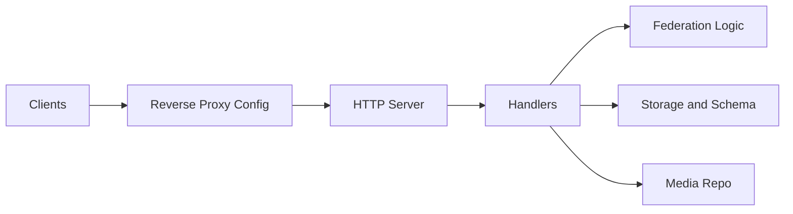

# element-hq/synapse

> Serveur d'accueil Matrix en Python, maintenu par Element, pour une messagerie fédérée et sécurisée.

## Le problème
Héberger sa propre messagerie temps réel interopérable, plutôt que dépendre d'un opérateur.

## Ce que ça fait vraiment
Un serveur Python (avec du Rust) expose les API client et fédération, gère les salons, événements, médias et chiffrement, et stocke dans PostgreSQL ou SQLite. Des workers séparés absorbent la charge. Le README oriente vers Element Server Suite pour le déploiement officiel.

## Comment c'est branché

## Essayer
Aucune commande dans le README fourni : renvoi à la documentation d'installation.

## Coût et pièges
Double licence : AGPL gratuite ou licence commerciale Element. Support uniquement avec un abonnement ESS. 2 084 issues ouvertes.

## Ce que ce n'est pas
Ce n'est pas un outil clé en main : ESS Community, Pro et TI-M sont les éditions officielles. Le support n'est pas assuré via GitHub.

## Alternatives
Aucune alternative nommée dans le README.

## Pour toi
À ignorer pour un travail data/IA : c'est de l'infrastructure de messagerie, à choisir seulement si tu dois héberger Matrix.

