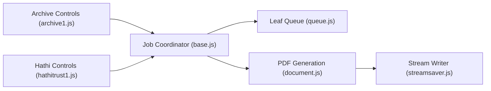

# elementdavv/internet_archive_downloader

> Extension de navigateur qui télécharge en PDF ou en images les livres empruntés sur Internet Archive.

## Le problème
Les livres empruntés ne se lisent qu'en ligne, pour une durée limitée.

## Ce que ça fait vraiment
- Récupère chaque page, construit un PDF en flux directement vers le disque (peu de mémoire).
- Sortie PDF avec texte intégré, ou images JPEG/PNG par page, plus texte.
- Gère aussi HathiTrust (accès intégral), plage de pages, téléchargements parallèles.
- Chromium 90 minimum, Firefox 115 minimum.

## Comment c'est branché

## Essayer
Aucune commande documentée : télécharger le .crx ou .xpi des Releases, ou installer depuis les boutiques Edge et Firefox.

## Coût et pièges
Gratuit. Le README déclare que télécharger des livres empruntés est interdit et demande de les supprimer sous 48 h : risque juridique à ta charge.

## Ce que ce n'est pas
Pas un outil de collecte pour jeux de données ; usage « à des fins d'étude » selon l'auteur.

## Alternatives
Aucune alternative nommée dans le README.

## Pour toi
À ignorer : contourne des restrictions d'emprunt, sans rapport avec ton métier et juridiquement risqué.

