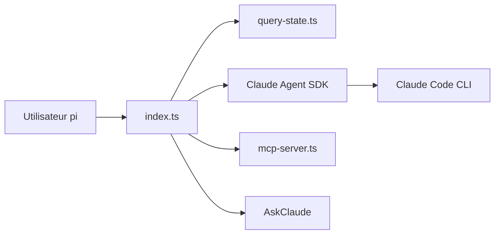

# elidickinson/pi-claude-bridge

> Extension pour l'éditeur agentique pi : utilise Claude Code comme fournisseur de modèles et outil de délégation.

## Le problème
Utiliser les modèles Claude dans pi via l'abonnement existant, avec les outils de pi, n'est pas direct.

## Ce que ça fait vraiment
Deux fonctions : un provider qui expose les modèles Claude (contexte 1M selon le plan) avec les appels d'outils passant par l'interface de pi, et un outil opt-in AskClaude pour déléguer à Claude Code (modes read, none, full ; isolé ou non). Appuyé sur le Claude Agent SDK ; transfère les skills ; reconstruit la session Claude depuis l'historique de pi.

## Comment c'est branché


## Essayer
```bash
pi install npm:pi-claude-bridge
```

## Coût et pièges
Consomme le quota de ton abonnement Claude ; le README signale une incertitude sur la facturation du Agent SDK. Une reconstruction de session renvoie tout l'historique (cache raté). Variables ANTHROPIC_* exportées cassent le fonctionnement.

## Ce que ce n'est pas
Pas autonome : exige pi 0.86.1+ et Claude Code. Ne lit pas les CLAUDE.md globaux lors des délégations.

## Alternatives
Aucune alternative citée dans le README.

## Pour toi
À surveiller : seulement si tu utilises déjà pi et un abonnement Claude ; sinon aucun intérêt.

