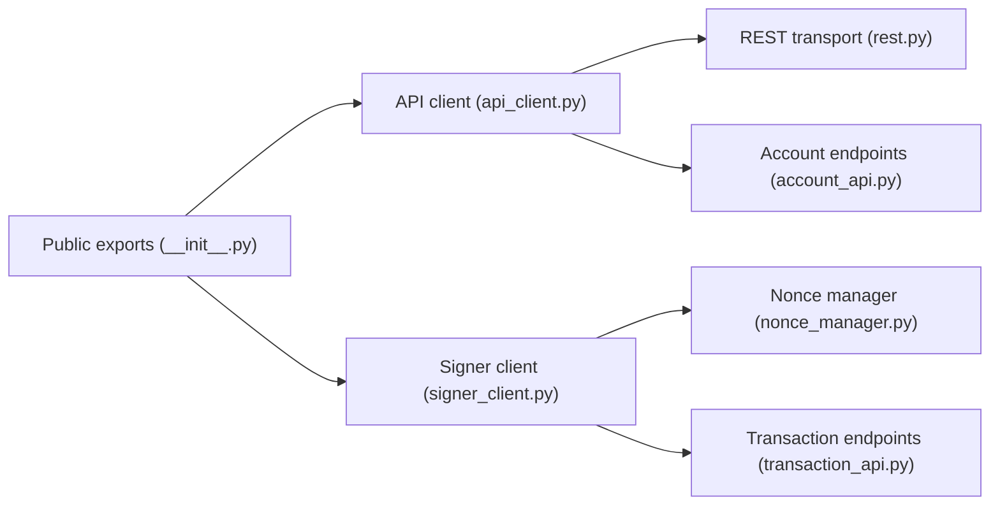

# elliottech/lighter-python

> SDK Python pour l'échange de contrats perpétuels zkLighter, avec REST, websocket et signature.

## Le problème
Interagir avec l'API de l'échange demande de construire les requêtes et de signer les transactions soi-même.

## Ce que ça fait vraiment
Client asynchrone avec classes typées par famille d'endpoints (compte, ordres, blocs, bridge, parrainage, transactions), modèles de réponse, client de signature avec gestionnaire de nonce (binaires natifs) et client websocket. Exemples fournis pour la lecture publique, les flux et les ordres.

## Comment c'est branché


## Essayer
```bash
pip install git+https://github.com/elliottech/zklighter-perps-python.git
python -c "import lighter"
```

## Coût et pièges
Gratuit ; ordres réels sur un échange, clé d'API et signataire à configurer. Python 3.8+. L'URL d'installation du README pointe vers un autre dépôt (`zklighter-perps-python`).

## Ce que ce n'est pas
Pas une stratégie de trading : seulement un client d'API. Le README liste les endpoints sans les expliquer.

## Alternatives
Aucune alternative nommée dans le README.

## Pour toi
À ignorer : utile seulement pour trader sur cet échange, sans lien avec data ou MLOps.

