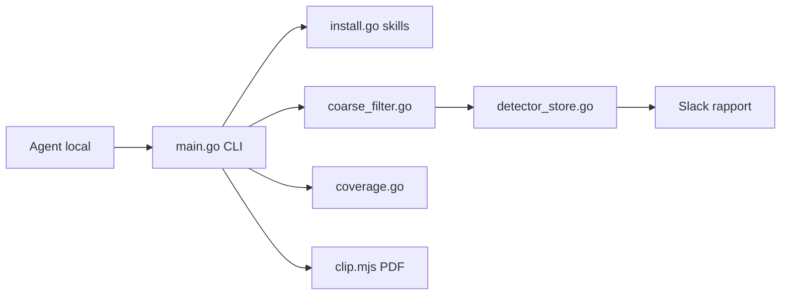

# elvisun/newsjack

> Une trentaine de skills d'agent et un CLI Go pour faire de la RP réactive et de la visibilité dans les réponses d'IA.

## Le problème
Fondateurs et petites agences font leurs relations presse à la main : veille, angle, liste de journalistes, relecture. Rien de tout cela ne s'enchaîne.

## Ce que ça fait vraiment
Des instructions Markdown (skills) que l'agent lit, plus un CLI `newsjack`. Quatre familles : détecter (veille, filtre grossier, triage), agir (angles, titres, fact-check, communiqué de crise, press-clip PDF), stratégie (calendrier, newsworthiness) et « AI visibility » (sept skills qui bâtissent un panel de prompts). Les skills de recherche ou de mise en relation passent par Medialyst, en option.

## Comment c'est branché


## Essayer
```bash
curl -fsSL newsjack.sh | bash
# ou
npm i -g newsjack@latest
newsjack login
newsjack auth status
```

## Coût et pièges
Les skills marqués 🔧 (recherche d'actualité, calendrier, journalistes) demandent un compte Medialyst gratuit. La mise à jour automatique depuis GitHub Releases est active par défaut (`NEWSJACK_AUTO_UPDATE=0` pour la couper). Le README conseille de relire `install.sh` avant le `curl | bash`.

## Ce que ce n'est pas
Ce n'est pas un outil de data science : c'est du marketing et de la RP. Sur Claude.ai, ChatGPT ou Cowork, la veille tourne en mode limité, sans état conservé. `press-clip` et les skills de configuration exigent un agent local.

## Alternatives
Aucune alternative nommée dans le README.

## Pour toi
Surveiller : seule la famille « AI visibility » (panel de prompts, contrôle de fuite de réponse) touche au métier IA ; le reste vise les RP et dépend de Medialyst.

