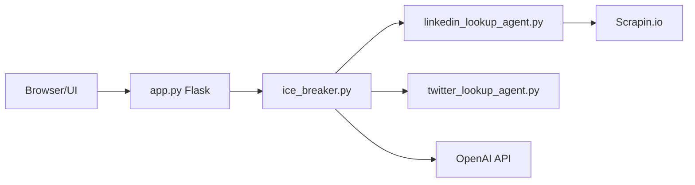

# emarco177/ice_breaker

> Cours de projets LangChain et LangGraph, dont l'application Ice Breaker, destiné à des développeurs Python.

## Le problème
Apprendre à construire des agents LLM utiles demande des projets concrets, pas des exemples jouets.

## Ce que ça fait vraiment
Le README décrit un cours (LangChain v1) de sept projets : hello world, agent de recherche avec Tavily, raisonnement/action, RAG, assistant de documentation, interpréteur de code, agents de réflexion et Agentic RAG. Certains sont sur des branches, d'autres dans des dépôts externes. L'application Ice Breaker (Flask) récupère des profils LinkedIn (Scrapin.io) et Twitter puis génère une accroche via OpenAI.

## Comment c'est branché


## Essayer
```bash
git clone https://github.com/emarco177/langchain-course
cd langchain-course
git checkout project/hello-world
uv sync
uv run python main.py
```

## Coût et pièges
Accès à un LLM (OpenAI, Anthropic, Gemini ou Ollama). Ice Breaker suppose Scrapin.io et l'API Twitter, services payants d'après le schéma. Le cours associé est vendu à part.

## Ce que ce n'est pas
Pas une bibliothèque réutilisable ni un cours pour débutants. Le README annonce trois versions de contenu différentes (7 projets, LangChain 0.3+ et v1.0) : ne pas s'y fier à la lettre.

## Alternatives
Aucune alternative nommée dans le README.

## Pour toi
À surveiller : bon support pour se former à LangChain, mais l'exemple Ice Breaker dépend de services de scraping payants et son intérêt tient à la formation, pas au code.
