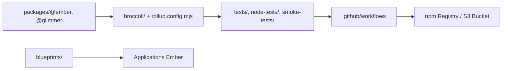

# emberjs/ember.js

> Framework JavaScript pour applications web ambitieuses, destiné aux équipes front-end qui veulent des conventions fortes.

## Le problème
Construire une grande application web demande de refaire les mêmes choix : routage, données, structure. Ember fournit des conventions pour éviter cela.

## Ce que ça fait vraiment
Le dépôt est un monorepo : le cœur du framework (`packages/@ember/*`, `@glimmer/*`), des générateurs de code (`blueprints/`), la chaîne de build (Broccoli, Rollup, Babel), des tests unitaires, d'intégration et de fumée. Côté usage, le README annonce routage, couche de données, réactivité par autotracking et composants HTML-first. La publication passe par des scripts dans `bin/` vers npm et un bucket S3.

## Comment c'est branché

## Essayer
Aucune commande documentée dans le README du dépôt (renvoi au site, aux guides et à CONTRIBUTING.md).

## Coût et pièges
Gratuit, Node requis. Le README ne détaille ni installation ni prérequis. Les tests croisés passent par BrowserStack (côté contributeurs).

## Ce que ce n'est pas
Ce n'est ni une bibliothèque de données ni un outil IA. C'est un framework complet à adopter dans son ensemble, pas une brique à greffer.

## Alternatives
Aucune alternative citée dans le README.

## Pour toi
Ignorer : un framework front-end généraliste sans lien avec les données, l'IA ou le MLOps ; à reconsidérer seulement si une équipe l'utilise déjà.

