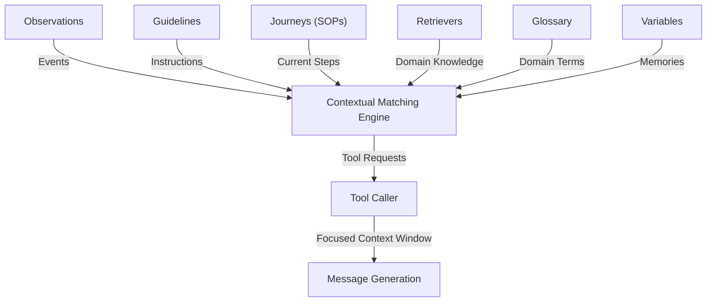

# emcie-co/parlant

> **A Python engine that narrows a conversational agent's context turn by turn, for customer-facing teams.**

## The problem

The README states two dead ends: a system prompt that stops being followed as instructions pile up,
and routed graphs that grow fragile as soon as a conversation leaves the planned path. In a regulated
domain you also need every decision to be auditable.

## What it actually does

Parlant does context selection: you declare rules, vocabulary and tools once, and the engine decides
per turn what enters the LLM prompt. The pieces named in the README are guidelines (condition/action
pairs), relationships (dependencies and exclusions between guidelines), journeys (multi-turn SOPs with
chat states and tool states), canned responses (the drafted message is swapped for the closest
pre-approved template), tools (activated only when their observation matches), a glossary of domain
synonyms, and OpenTelemetry tracing of every guideline match. Two composition modes are documented:
fluid (generated message) and strict (pre-approved message).

## How it is wired

No GitDiagram diagram exists for this repo; the graph below is taken from the README's own mermaid.



In code everything goes through `parlant.sdk`: `p.Server()`, `server.create_agent()`, then
`agent.create_guideline()`, `create_observation()`, `create_journey()`, `create_term()`,
`create_canned_response()`, and the `@p.tool` decorator returning a `p.ToolResult`. A `ToolResult` can
inject dynamic guidelines, which is how a compiled LangGraph `StateGraph` or a LlamaIndex query engine
is wrapped as a plain Parlant tool.

## Trying it

```bash
pip install parlant
```

```python
import parlant.sdk as p

async with p.Server():
    agent = await server.create_agent(
        name="Customer Support",
        description="Handles customer inquiries for an airline",
    )
```

The README then points to a quickstart hosted on parlant.io; no command for starting a server or a UI
appears in the README itself.

## Cost and gotchas

Python 3.10+ and an LLM API key you pay for. The README recommends Emcie first — the vendor's own
provider, described as built for Parlant — then OpenAI and Anthropic, with any other model reachable
through LiteLLM and an explicit warning that small off-the-shelf models give inconsistent results. The
real cost is an inference bill, amplified because the engine runs several passes per turn (guideline
matching, tool calls, optional extra matching iterations, then generation). Per-conversation cost is
not documented.

## What it is not

It is not a workflow orchestration framework: the README says outright that Parlant does not replace
your stack and sits alongside LangGraph, Agno or LlamaIndex, covering only the behavioral control
layer. It is not an output guardrail bolted on afterwards, and it is not LLM-free: guidelines are
matched by a model, and only canned responses actually remove hallucination risk, at the moments where
you enable them. The README is also heavily promotional, with customer quotes, and the vendor Emcie
sells the recommended model provider too.

## Alternatives

- **langchain-ai/langgraph** — the README frames it as complementary: graphs for workflow automation,
  Parlant for conversational governance. Pick it when the need is a stepwise flow.
- **langchain-ai/langchain** — the generic orchestration and connector layer, without the per-turn
  guideline selection mechanism.
- **microsoft/agent-governance-toolkit** — a catalogue neighbour on agent governance; comparability
  cannot be checked from this README, which does not mention it.

## Why it matters to you

Worth watching if you build a customer-facing agent in a domain where each answer must be explainable:
per-decision OpenTelemetry tracing and pre-approved responses are angles rarely found elsewhere. Watch
rather than adopt right away, given the pull towards the vendor's own LLM provider and the inference
cost multiplied per turn.
