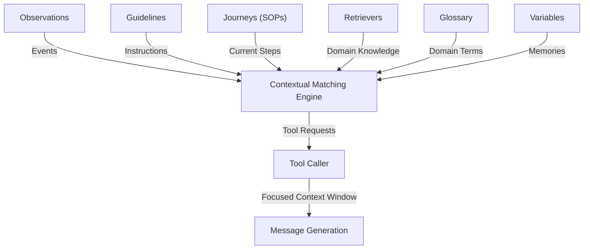

# emcie-co/parlant

> **Un moteur Python qui filtre le contexte d'un agent conversationnel tour par tour, pour équipes support client.**

## Le problème

Le README pose deux impasses : un prompt système auquel on ajoute des instructions jusqu'à ce que
l'agent cesse d'en suivre aucune, et des graphes de routage qui deviennent fragiles dès que la
conversation sort du chemin prévu. Dans un domaine régulé, il faut aussi pouvoir tracer chaque décision.

## Ce que ça fait vraiment

Parlant fait de la sélection de contexte : tu déclares des règles, du vocabulaire et des outils une fois,
et le moteur choisit à chaque tour ce qui entre dans le prompt du LLM.
Les briques nommées dans le README : *guidelines* (paires condition/action), *relationships*
(dépendances et exclusions entre guidelines), *journeys* (procédures multi-tours avec transitions et
états outil), *canned responses* (le message généré est remplacé par le gabarit pré-approuvé le plus
proche), *tools* (activés seulement quand leur observation correspond), *glossary* (synonymes métier),
et un traçage OpenTelemetry de chaque correspondance de guideline.
Deux modes de composition sont documentés : fluide (message généré) et strict (message pré-approuvé).

## Comment c'est branché

Pas de diagramme GitDiagram pour ce dépôt ; le schéma ci-dessous est repris du mermaid du README.



Côté code, tout passe par `parlant.sdk` : `p.Server()`, `server.create_agent()`, puis
`agent.create_guideline()`, `create_observation()`, `create_journey()`, `create_term()`,
`create_canned_response()`, et le décorateur `@p.tool` qui renvoie un `p.ToolResult`.
Un `ToolResult` peut injecter des guidelines dynamiques, ce qui permet d'emballer un `StateGraph`
LangGraph compilé ou un moteur de requête LlamaIndex comme simple outil Parlant.

## Essayer

```bash
pip install parlant
```

```python
import parlant.sdk as p

async with p.Server():
    agent = await server.create_agent(
        name="Customer Support",
        description="Handles customer inquiries for an airline",
    )
```

Le README renvoie ensuite vers un quickstart hébergé sur parlant.io ; aucune commande de lancement de
serveur ou d'interface n'est donnée dans le README lui-même.

## Coût et pièges

Python 3.10+ et une clé d'API de LLM à ta charge. Le README recommande d'abord Emcie, le fournisseur
de l'éditeur, en le présentant comme taillé pour Parlant ; OpenAI et Anthropic sont cités ensuite, et
n'importe quel modèle passe par LiteLLM — avec l'avertissement explicite que les petits modèles
donnent des résultats incohérents. Le coût réel est donc une facture d'inférence, amplifiée par le fait
que le moteur fait plusieurs passes par tour (correspondance de guidelines, appel d'outils, éventuelles
itérations supplémentaires, puis génération). Le prix par conversation n'est pas documenté.

## Ce que ce n'est pas

Ce n'est pas un framework d'orchestration de workflows : le README dit explicitement que Parlant ne
remplace pas ta pile et se pose à côté de LangGraph, Agno ou LlamaIndex, sur la seule couche de contrôle
comportemental. Ce n'est pas non plus un garde-fou de sortie ajouté après coup, ni un système sans LLM :
les guidelines sont évaluées par un modèle, et seuls les *canned responses* suppriment vraiment le
risque d'hallucination, sur les moments où tu les actives. Enfin le README multiplie les arguments
commerciaux et les citations clients : l'éditeur Emcie vend aussi le fournisseur de modèles recommandé.

## Alternatives

- **langchain-ai/langgraph** — le README le cite comme complémentaire : graphes pour l'automatisation de
  workflows, Parlant pour la gouvernance conversationnelle. À choisir si ton besoin est un flux à étapes.
- **langchain-ai/langchain** — la couche d'orchestration et de connecteurs générique, sans le mécanisme
  de sélection de guidelines par tour.
- **microsoft/agent-governance-toolkit** — voisin de catalogue sur le thème gouvernance d'agents ;
  comparabilité non vérifiable depuis ce README, qui ne le mentionne pas.

## Pour toi

Intéressant si tu construis un agent face à des clients dans un domaine où chaque réponse doit être
explicable : la traçabilité OpenTelemetry par décision et les réponses pré-approuvées sont des angles
qu'on trouve rarement ailleurs. À surveiller plutôt qu'à adopter tout de suite, vu la dépendance à un
fournisseur de LLM recommandé par l'éditeur et le coût d'inférence multiplié par tour.
