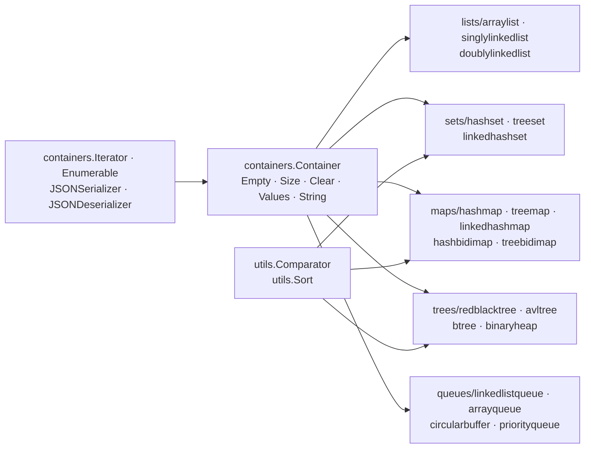

# emirpasic/gods

> **Twenty classic data structures for Go, no external dependencies, behind one common interface.**

## The problem

Go's standard library ships slices and `map`, and nothing else: no set, no stack, no priority
queue, no ordered dictionary, no balanced tree. Every project therefore rewrites its own
red-black tree or its own `map[T]struct{}`-backed set, with API conventions that differ from
one package to the next.

## What it actually does

GoDS implements the missing structures and makes all of them converge on a single `Container`
interface (`Empty`, `Size`, `Clear`, `Values`, `String`). The README enumerates them: three
lists (`ArrayList`, `SinglyLinkedList`, `DoublyLinkedList`), three sets (`HashSet`, `TreeSet`,
`LinkedHashSet`), two stacks, five maps including two bidirectional ones (`HashMap`, `TreeMap`,
`LinkedHashMap`, `HashBidiMap`, `TreeBidiMap`), four trees (`RedBlackTree`, `AVLTree`, `BTree`,
`BinaryHeap`) and four queues (`LinkedListQueue`, `ArrayQueue`, `CircularBuffer`,
`PriorityQueue`).

On top of the containers, the README documents four cross-cutting families of functions:
comparators (`utils.StringComparator`, `utils.IntComparator`, or your own) that decide the
ordering of ordered structures; stateful iterators, by index or by key, half of them
reversible; enumerable functions over ordered containers — `Each`, `Map`, `Select`, `Any`,
`All`, `Find` — which chain together; and JSON serialization both ways, wired into
`json.Marshal` and `json.Unmarshal` through `ToJSON` / `FromJSON`.

The stated goals in the README: no external imports, backward compatibility ("only additions
are permitted"), and a bias towards speed when speed and memory conflict. The README states
that thread safety is not a concern of the project.

## How it is wired



No code-derived diagram exists for this repository: this one is reconstructed from the README
alone. What it makes visible is the internal layering: `TreeSet`, `TreeMap` and `TreeBidiMap`
are built on `RedBlackTree`, `LinkedHashSet` and `LinkedHashMap` on a hash table paired with a
linked list, and every ordered structure goes through a caller-supplied `utils.Comparator`.

## Trying it

The README documents no installation command — no `go get`, no `go mod`. It does give the
import paths, to be taken as they are:

```go
package main

import (
	"github.com/emirpasic/gods/lists/arraylist"
	"github.com/emirpasic/gods/utils"
)

func main() {
	list := arraylist.New()
	list.Add("a")                         // ["a"]
	list.Add("c", "b")                    // ["a","c","b"]
	list.Sort(utils.StringComparator)     // ["a","b","c"]
	_, _ = list.Get(0)                    // "a",true
	_, _ = list.Get(100)                  // nil,false
	_ = list.Contains("a", "b", "c")      // true
}
```

The only two shell commands on the page are the contributor's — the benchmark:

```bash
go test -run=NO_TEST -bench . -benchmem  -benchtime 1s ./...
```

and the coding-style chain:

```bash
go install gotest.tools/gotestsum@latest
go install golang.org/x/lint/golint@latest
go install github.com/kisielk/errcheck@latest
export PATH=$PATH:$GOPATH/bin

go fmt ./... &&
go test -v ./... && 
golint -set_exit_status ./... && 
! go fmt ./... 2>&1 | read &&
go vet -v ./... &&
gocyclo -avg -over 15 ../gods &&
errcheck ./...
```

## Cost and traps

- **Free, no prerequisites**: no API key, no third-party service, no account. The README claims
  zero external imports — the only dependency is the Go toolchain.
- **The API is `interface{}`-based**, not generic: `Get` returns `(interface{}, bool)`, `Values`
  returns `[]interface{}`. Every README example ends in a type assertion (`value.(int)`,
  `key.(string)`). That is the cost: no compiler checking, and a conversion on every read. The
  README mentions no generics-based variant.
- **Concurrency safety is on you**: "Thread safety is not a concern of this project, this should
  be handled at a higher level." A container shared between goroutines needs your own lock.
- **A comparator is mandatory** for ordered structures, and picking one fixes the key type:
  `treeset.NewWithIntComparator()` is a set of ints, not a generic set.
- **License**: the README badge announces BSD-2-Clause and the appendix speaks of a "BSD-style
  license", but the catalogue records `NOASSERTION` — GitHub failed to identify the file. Check
  the repository's `LICENSE` before any internal use; that is the reason for the alert.
- **The benchmark is slow**: the README warns ("this takes a while") and advises running it
  sub-package by sub-package.

## What it is not

- **It is not a concurrent library.** That is the main misunderstanding: nothing is guarded by a
  lock, and the README explicitly declines the subject. A GoDS `HashMap` shared between
  goroutines behaves like a bare Go `map`.
- **It is not a database or a persistent cache**: everything lives in memory, and the JSON
  serialization is an export, not storage.
- **It is not a replacement for Go's `map` and slices** in simple cases: where the standard
  library is enough, GoDS adds indirection and type assertions for nothing. Its value starts
  with the structures Go lacks — trees, sets, priority queues, ordered maps.
- **It is not a general algorithms library** despite the subtitle: beyond sorting
  (`utils.Sort`) and the structures themselves, no graph, no traversal, no path-finding
  algorithm is documented.
- **The declared backward compatibility cuts both ways**: "only additions are permitted" means
  the `interface{}` API will not be fixed in place.

## Alternatives

No comparable alternative in the catalogue. The README names no competing repository — it
cites non-Go inspirations (Java Collections, the C++ STL, Qt containers, Ruby's `Enumerable`),
not GitHub projects. The three lexically computed neighbours are off-topic:
`EndlessCheng/codeforces-go` is a collection of competitive-programming implementations rather
than a library to import, `quii/learn-go-with-tests` is a course on test-driven development,
and `klauspost/compress` deals with data compression.

## For you

Worth watching rather than adopting, because the deciding criterion is language: if your
data / MLOps stack is Python, this matters only the day you write an internal Go tool and hit
the missing set or ordered map — and then it is the reasonable first reflex, dependency-free
and with a README that doubles as documentation by example. The second use is indirect: gods
often shows up as a transitive dependency of Go tooling, and knowing that its API is not
concurrency-safe prevents assuming guarantees it does not offer.
