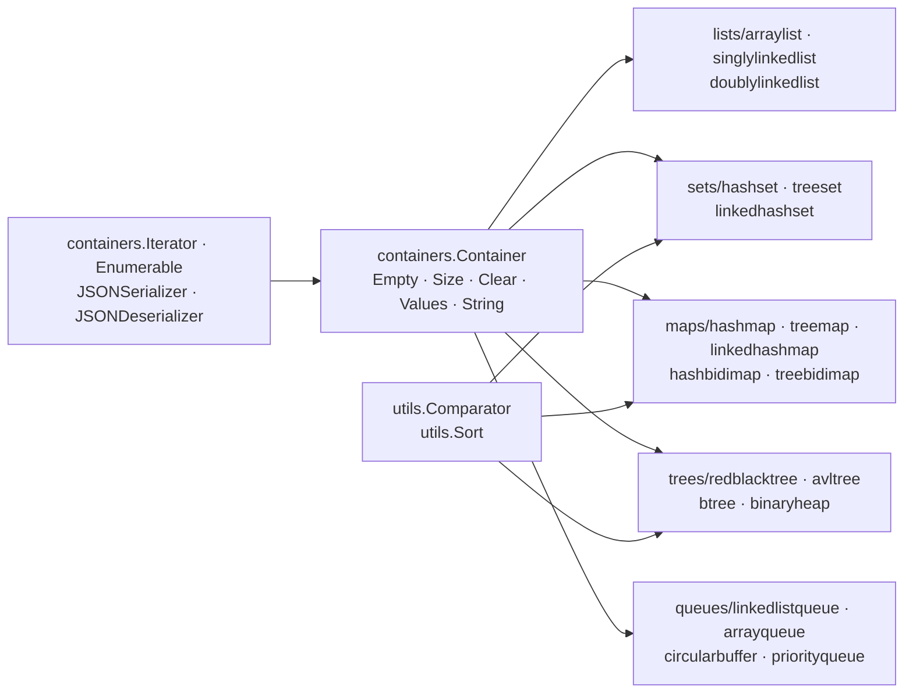

# emirpasic/gods

> **Vingt structures de données classiques pour Go, sans dépendance externe, derrière une interface commune.**

## Le problème

La bibliothèque standard de Go fournit les tranches et les `map`, et rien d'autre : pas
d'ensemble, pas de pile, pas de file de priorité, pas de dictionnaire ordonné, pas d'arbre
équilibré. Chaque projet réécrit donc son arbre rouge-noir ou son ensemble à base de
`map[T]struct{}`, avec des conventions d'API différentes d'un paquet à l'autre.

## Ce que ça fait vraiment

GoDS implémente ces structures manquantes et les fait toutes converger vers une même interface
`Container` (`Empty`, `Size`, `Clear`, `Values`, `String`). Le README dénombre : trois listes
(`ArrayList`, `SinglyLinkedList`, `DoublyLinkedList`), trois ensembles (`HashSet`, `TreeSet`,
`LinkedHashSet`), deux piles, cinq dictionnaires dont deux bidirectionnels (`HashMap`,
`TreeMap`, `LinkedHashMap`, `HashBidiMap`, `TreeBidiMap`), quatre arbres (`RedBlackTree`,
`AVLTree`, `BTree`, `BinaryHeap`) et quatre files (`LinkedListQueue`, `ArrayQueue`,
`CircularBuffer`, `PriorityQueue`).

Par-dessus les conteneurs, le README documente quatre familles de fonctions transverses : des
comparateurs (`utils.StringComparator`, `utils.IntComparator`, et les siens) qui déterminent
l'ordre des structures ordonnées ; des itérateurs avec état, par index ou par clé, la moitié
réversibles ; des fonctions énumérables sur les conteneurs ordonnés — `Each`, `Map`, `Select`,
`Any`, `All`, `Find` — chaînables entre elles ; et la sérialisation JSON dans les deux sens,
branchée sur `json.Marshal` et `json.Unmarshal` via `ToJSON` / `FromJSON`.

Les objectifs déclarés du README : pas d'import externe, rétrocompatibilité (« seules les
additions sont permises »), arbitrage en faveur de la vitesse quand elle s'oppose à la mémoire.
Le README indique que la sûreté d'accès concurrent n'est pas du ressort du projet.

## Comment c'est branché



Aucun diagramme tiré du code n'existe pour ce dépôt : ce schéma est reconstruit depuis le seul
README. Le point à retenir est la double dépendance interne qu'il rend visible : `TreeSet`,
`TreeMap` et `TreeBidiMap` sont bâtis sur `RedBlackTree`, `LinkedHashSet` et `LinkedHashMap`
sur une table de hachage doublée d'une liste chaînée, et toutes les structures ordonnées
passent par un `utils.Comparator` fourni par l'appelant.

## Essayer

Le README ne documente aucune commande d'installation — pas de `go get`, pas de `go mod`. Il
donne en revanche les chemins d'import, à reprendre tels quels dans le code :

```go
package main

import (
	"github.com/emirpasic/gods/lists/arraylist"
	"github.com/emirpasic/gods/utils"
)

func main() {
	list := arraylist.New()
	list.Add("a")                         // ["a"]
	list.Add("c", "b")                    // ["a","c","b"]
	list.Sort(utils.StringComparator)     // ["a","b","c"]
	_, _ = list.Get(0)                    // "a",true
	_, _ = list.Get(100)                  // nil,false
	_ = list.Contains("a", "b", "c")      // true
}
```

Les deux seules commandes de la page sont celles du contributeur — le banc d'essai :

```bash
go test -run=NO_TEST -bench . -benchmem  -benchtime 1s ./...
```

et la chaîne de vérification du style de code :

```bash
go install gotest.tools/gotestsum@latest
go install golang.org/x/lint/golint@latest
go install github.com/kisielk/errcheck@latest
export PATH=$PATH:$GOPATH/bin

go fmt ./... &&
go test -v ./... && 
golint -set_exit_status ./... && 
! go fmt ./... 2>&1 | read &&
go vet -v ./... &&
gocyclo -avg -over 15 ../gods &&
errcheck ./...
```

## Coût et pièges

- **Gratuit, sans prérequis** : pas de clé d'API, pas de service tiers, pas de compte. Le README
  revendique l'absence totale d'import externe — la seule dépendance est la chaîne Go.
- **L'API est en `interface{}`**, pas en génériques : `Get` rend `(interface{}, bool)`, `Values`
  rend `[]interface{}`. Tous les exemples du README se terminent par une assertion de type
  (`value.(int)`, `key.(string)`). Le coût est là : pas de vérification au compilateur, et une
  conversion à chaque lecture. Le README ne mentionne aucune variante à génériques.
- **La sûreté concurrente est à ta charge** : « Thread safety is not a concern of this project,
  this should be handled at a higher level. » Un conteneur partagé entre goroutines demande ton
  propre verrou.
- **Le comparateur est obligatoire** pour les structures ordonnées, et son choix fige le type
  des clés : `treeset.NewWithIntComparator()` est un ensemble d'entiers, pas un ensemble
  générique.
- **Licence** : le badge du README annonce BSD-2-Clause et l'annexe parle d'une « BSD-style
  license », mais le catalogue relève `NOASSERTION` — GitHub n'a pas su identifier le fichier.
  À lever sur le `LICENSE` du dépôt avant tout usage interne ; c'est la raison de l'alerte.
- **Le banc d'essai est long** : le README prévient (« this takes a while ») et conseille de le
  lancer sous-paquet par sous-paquet.

## Ce que ce n'est pas

- **Ce n'est pas une bibliothèque concurrente.** C'est le malentendu principal : rien n'est
  protégé par verrou, et le README refuse explicitement le sujet. Un `HashMap` de GoDS partagé
  entre goroutines se comporte comme une `map` Go nue.
- **Ce n'est pas une base de données ni un cache persistant** : tout vit en mémoire, la
  sérialisation JSON est un export, pas un stockage.
- **Ce n'est pas un remplacement des `map` et tranches de Go** pour les cas simples : là où la
  bibliothèque standard suffit, GoDS ajoute une indirection et des assertions de type sans rien
  apporter. Son intérêt commence aux structures que Go n'a pas — arbres, ensembles, files de
  priorité, dictionnaires ordonnés.
- **Ce n'est pas une bibliothèque d'algorithmes généraux** malgré le sous-titre : au-delà du
  tri (`utils.Sort`) et des structures elles-mêmes, aucun graphe, aucun parcours, aucun
  algorithme de chemin n'est documenté.
- **La rétrocompatibilité déclarée a un revers** : « seules les additions sont permises »
  signifie que l'API en `interface{}` ne sera pas corrigée en place.

## Alternatives

Aucune alternative comparable dans le catalogue. Le README ne nomme aucun dépôt concurrent — il
cite des inspirations hors Go (Java Collections, la STL du C++, les conteneurs Qt, `Enumerable`
de Ruby), pas des projets GitHub. Les trois voisins proposés par le lexique sont hors sujet :
`EndlessCheng/codeforces-go` est un recueil d'implémentations pour la programmation compétitive
et non une bibliothèque à importer, `quii/learn-go-with-tests` est un cours sur le
développement piloté par les tests, et `klauspost/compress` traite de la compression de
données.

## Pour toi

À surveiller plutôt qu'à adopter, parce que le critère décisif est la langue : si ta chaîne
data / MLOps est en Python, cette fiche ne te concerne que le jour où tu écris un outil interne
en Go et où tu butes sur l'absence d'ensemble ou de dictionnaire ordonné — alors c'est le
premier réflexe raisonnable, sans dépendance et avec un README qui fait office de
documentation par l'exemple. Le second usage est indirect : gods apparaît souvent en
dépendance transitive d'outils Go, et savoir que l'API n'est pas concurrente évite d'en
déduire des garanties qu'elle n'offre pas.
