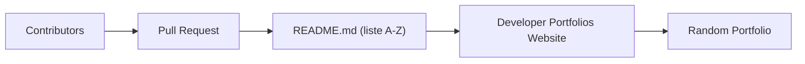

# emmabostian/developer-portfolios

> Liste alphabétique de portfolios de développeurs, pour s'inspirer avant de construire le sien.

## Le problème
Créer un portfolio sans exemples concrets rend difficile de choisir une structure ou un style.

## Ce que ça fait vraiment
Un fichier README qui recense 1986 portfolios classés de A à Z avec, souvent, le titre déclaré par la personne (« Full Stack Developer », « AI Engineer »). On contribue par pull request. Un site associé et une fonction de portfolio aléatoire existent. Le contenu est une liste de liens vers des sites personnels.

## Comment c'est branché

## Essayer
Aucune commande ; le README invite à ouvrir une pull request pour ajouter son portfolio.

## Coût et pièges
Gratuit. Les liens pointent vers des sites tiers dont personne ne garantit l'état ni le contenu. Aucune licence déclarée. Analyse partielle : une portion du README (entrées B à S) n'a pas pu être lue dans ce bloc, l'essentiel est une liste de noms.

## Ce que ce n'est pas
Ce n'est pas un modèle ni un gabarit de portfolio : c'est un annuaire de liens. Le diagramme fourni est générique et ne reflète aucun code.

## Alternatives
- Aucune alternative nommée dans le README.

## Pour toi
Ignorer : simple source d'inspiration visuelle, sans valeur technique pour un profil data/IA.

