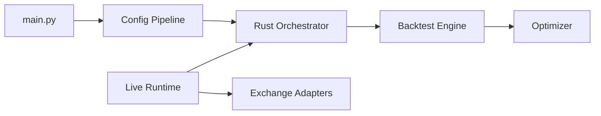

# enarjord/passivbot

> Robot de trading de contrats perpétuels crypto, teneur de marché contrarien, avec backtest et optimiseur.

## Le problème
Placer et annuler des ordres limites en continu sur des marchés dérivés sans intervention manuelle.

## Ce que ça fait vraiment
Un orchestrateur Rust partagé calcule les ordres en live et en backtest. Stratégie par défaut `trailing_martingale` (petite entrée, ajouts contre le prix, clôtures avec marge ou trailing), `ema_anchor`, sélection de marchés (Forager) et mécanisme de déblocage de positions. Un optimiseur évolutionnaire itère des milliers de backtests. Exchanges cités : Bybit, OKX, Bitget, Binance, Hyperliquid et d'autres.

## Comment c'est branché


## Essayer
```bash
git clone https://github.com/enarjord/passivbot.git
cd passivbot
python3 -m pip install -e .
cp api-keys.json.example api-keys.json
passivbot live -u {account_name_from_api-keys.json}
```

## Coût et pièges
Gratuit, mais capital et clés d'API d'exchange à ta charge. Python 3.12 ou 3.14 (pas 3.13), Rust requis. Le v8 casse les configs v7. Le README contient des liens de parrainage.

## Ce que ce n'est pas
Pas un gage de profit : « usage à ses risques ». Ne prédit pas les prix.

## Alternatives
Le README cite une interface graphique, `msei99/pbgui`.

## Pour toi
À surveiller pour son moteur de backtest et d'optimisation évolutionnaire, mais trading avec argent réel : hors périmètre, risque financier.

