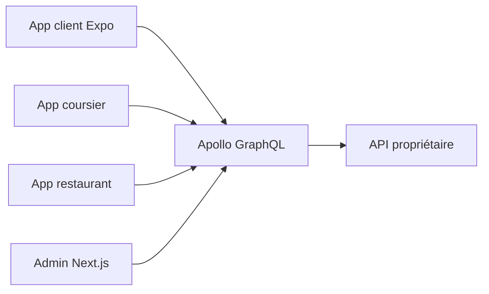

# enatega/food-delivery-multivendor

> Suite de commande et livraison multi-vendeurs : apps client, coursier, restaurant, web et administration.

## Le problème
Lancer une plateforme de livraison (repas, courses, pharmacie) sans tout construire : trois applis mobiles, un site et un back-office.

## Ce que ça fait vraiment
Clients React Native (Expo), site client, tableau de bord Next.js, tous branchés sur une API GraphQL. Suivi des coursiers, notifications, paiements PayPal et Stripe, thèmes et langues. Amplitude et Sentry font l'analytique et le suivi d'erreurs. Le README précise que le backend et l'API sont propriétaires.

## Comment c'est branché


## Essayer
```bash
cd enatega-multivendor-admin && nvm use && npm install && cp .env.example .env.local && npm run dev
cd enatega-multivendor-app && npm install && npx expo start -c
```

## Coût et pièges
API et backend sous licence payante, hors de ce dépôt (le guide renvoie à `../enatega-multivendor-api`). Il faut créer des identifiants Firebase, Google, Facebook, Mongo, email et Amplitude. Node de 18 à 20 selon le README.

## Ce que ce n'est pas
Ce n'est pas une solution open source complète malgré la licence MIT du catalogue : sans le backend payant, rien ne tourne de bout en bout.

## Alternatives
Aucune alternative nommée dans le README.

## Pour toi
Ignorer : produit de livraison dont le cœur est payant et fermé, sans rapport avec un profil data ou MLOps.

