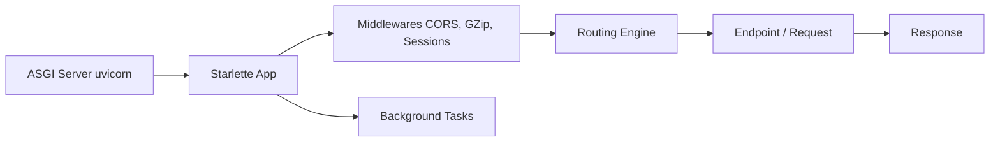

# encode/starlette

> Framework ASGI léger pour services web asynchrones en Python, utilisable seul ou comme boîte à outils.

## Le problème
Servir des API asynchrones en Python demande une couche ASGI simple, sans dépendances lourdes.

## Ce que ça fait vraiment
Routage HTTP, WebSockets, tâches d'arrière-plan, événements de démarrage et d'arrêt, réponses en flux, sessions et cookies. Middlewares CORS, GZip, redirection HTTPS, hôtes de confiance. Client de test basé sur `httpx2`. Seule dépendance requise : `anyio` ; Jinja2, python-multipart, itsdangerous et pyyaml sont optionnels. Fonctionne avec asyncio et trio.

## Comment c'est branché


## Essayer
```bash
pip install starlette
pip install uvicorn
uvicorn main:app
```

## Coût et pièges
Gratuit ; il faut un serveur ASGI à part comme uvicorn. Le README indique la documentation sur starlette.dev et le code sur Kludex/starlette, ce qui suggère un déménagement du dépôt.

## Ce que ce n'est pas
Pas un framework « tout compris » : ni ORM ni validation de données intégrés.

## Alternatives
Aucune alternative citée dans le README (des implémentations de serveurs ASGI alternatives à uvicorn sont évoquées).

## Pour toi
À adopter : socle de nombreux services d'inférence Python, léger, typé et sous BSD-3-Clause.

