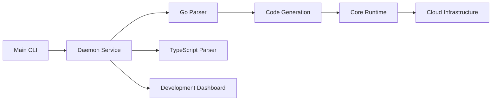

# encoredev/encore

> SDK Go/TypeScript qui déclare l'infra dans le code et la provisionne localement puis sur AWS/GCP.

## Le problème
Écrire le code, puis le Terraform, puis monter l'infra locale équivalente crée des écarts entre dev et prod.

## Ce que ça fait vraiment
On déclare bases SQL, Pub/Sub, buckets, cache, cron, secrets dans le code ; `encore run` lance Postgres, NSQ, Redis locaux avec tracing et tableau de bord (`localhost:9400`).
Un graphe d'application est comparé à l'environnement et provisionne RDS/SQS/S3 ou Cloud SQL/Pub/Sub dans ton compte.
Plateforme optionnelle : environnements de preview par PR, IAM dérivé du code.
`encore build docker` pour auto-héberger ; serveur MCP pour agents.

## Comment c'est branché


## Essayer
```bash
curl -L https://encore.dev/install.sh | bash
encore app create
cd myapp
encore run
```

## Coût et pièges
SDK MPL-2.0 gratuit ; la plateforme managée est payante (voir pricing) et le provisioning auto vise AWS/GCP seulement.
Python « coming soon » : inutilisable pour un backend Python aujourd'hui.

## Ce que ce n'est pas
Pas un IaC généraliste : couvre les ressources courantes, le reste reste à ta charge.
Pas de support Azure pour le provisioning automatique.

## Alternatives
- Pulumi / CDK / Terraform / SST : IaC séparé du code, plus de contrôle.
- Convex / Supabase / Firebase : backend managé, mais pas dans ton compte cloud.
- Render / Fly.io / Railway / Vercel : PaaS plus simple, runtime non maîtrisé.

## Pour toi
À surveiller pour le jour où le SDK Python sort : aujourd'hui Go/TypeScript seulement, donc hors de ta stack data.
