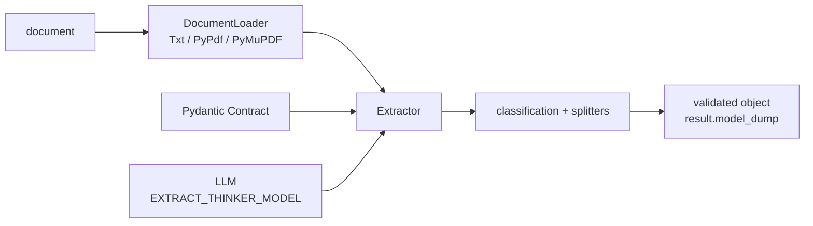

# enoch3712/ExtractThinker

> **A Python library that turns documents into validated Pydantic objects through an LLM.**

## The problem

Without it, pulling fields out of an invoice or a mixed bundle of PDFs means writing the whole chain
yourself — parsing, splitting, prompting, parsing the answer back, validating — and rewriting it for
every document format and every model provider.

## What it actually does

You declare a Pydantic contract (`Contract`), pick a document loader and an `LLM`, then call
`extractor.extract(...)`, which returns a validated instance. The README states four steps: load,
classify, split, extract. Documented components cover loaders (PDFs, images, tables, spreadsheets),
Pydantic contracts with constraints and post-validation, classification and splitters for mixed
bundles, completion strategies for long inputs or truncated responses, and local models through
Ollama. The README notes that schema validity does not guarantee factual accuracy.

## How it is wired



No code-derived diagram exists for this repository; the graph above only names pieces the README
mentions.

## Trying it

```bash
pip install extract-thinker
```

```python
import os
from pydantic import Field
from extract_thinker import Contract, DocumentLoaderTxt, Extractor, LLM

class Invoice(Contract):
    invoice_number: str
    supplier: str
    total: float = Field(ge=0)
    currency: str

extractor = Extractor(
    DocumentLoaderTxt(),
    LLM(os.environ["EXTRACT_THINKER_MODEL"], token_limit=1000),
)
result = extractor.extract("invoice.txt", Invoice)
print(result.model_dump())
```

The 2026 additions (SQLite page retrieval, parallel field extraction, model routing, local entity
masking, PyMuPDF/Camelot/Tabula/Adobe loaders, an MCP service with Docker Compose) are not in a PyPI
release yet:

```bash
git clone https://github.com/enoch3712/ExtractThinker.git
cd ExtractThinker
pip install -e .
```

## Cost and gotchas

You need `EXTRACT_THINKER_MODEL` set and the matching provider API key: the inference bill is yours,
and the README says extraction "may incur charges". PDFs require `pypdf` and `DocumentLoaderPyPdf`;
scanned documents need OCR or a vision-capable model. System MIME detection requires libmagic
(`brew install libmagic`, `apt-get install libmagic1`). The core targets Python 3.9–3.13, the
optional MCP service Python 3.10+. The 2026 features only exist in a checkout, not in the release.

## What it is not

It is neither an OCR engine nor a PDF parser: reading is delegated to third-party loaders (pypdf,
PyMuPDF, Camelot, Tabula, Adobe) or to a vision model. It is not an accuracy guarantee either — the
README says plainly that schema conformance is not truth and asks you to evaluate on your own
documents. And it is not a document management system: no storage, no interface, no archiving
workflow.

## Alternatives

- `opendatalab/MinerU` and `ocrmypdf/OCRmyPDF`: if the job is converting or OCR-ing the PDF itself,
  that is their business, not ExtractThinker's, which assumes readable text upstream.
- `oomol-lab/pdf-craft`: same upstream role, document structure extraction without a typed contract.
- `paperless-ngx/paperless-ngx`: a full document management system for archiving and search, not a
  library to embed in code.

## Why it matters to you

The interesting part for a data/AI profile is that the output is a validated Pydantic object —
testable and pipeline-friendly rather than a JSON blob to trust on faith. Worth watching more than
adopting right now: the repository is carried by a personal account, and the appealing pieces (model
routing, MCP, entity masking) are not in a published version yet.
