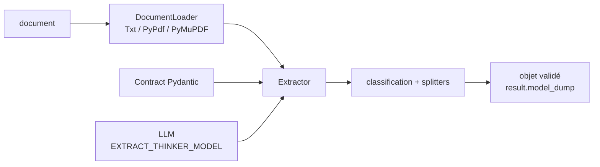

# enoch3712/ExtractThinker

> **Une bibliothèque Python qui transforme des documents en objets Pydantic validés via un LLM.**

## Le problème

Sans elle, extraire des champs d'une facture ou d'un lot de PDF mélangés revient à écrire soi-même
le chaînage parsing → découpage → prompt → parsing de la réponse → validation, et à le refaire pour
chaque format de document et chaque fournisseur de modèle.

## Ce que ça fait vraiment

On déclare un contrat Pydantic (`Contract`), on choisit un *document loader* et un `LLM`, puis on
appelle `extractor.extract(...)`, qui rend une instance validée. Le README annonce quatre étapes :
charger, classifier, découper, extraire. Des composants documentés couvrent les loaders (PDF, images,
tableaux, tableurs), les contrats Pydantic avec contraintes et post-validation, la classification et
les *splitters* pour des liasses mixtes, les stratégies de complétion pour entrées longues ou réponses
tronquées, et l'usage de modèles locaux via Ollama. Le README précise que la validité du schéma ne
garantit pas l'exactitude factuelle.

## Comment c'est branché



Aucun diagramme tiré du code n'est disponible pour ce dépôt ; ce schéma reprend les pièces nommées
dans le README.

## Essayer

```bash
pip install extract-thinker
```

```python
import os
from pydantic import Field
from extract_thinker import Contract, DocumentLoaderTxt, Extractor, LLM

class Invoice(Contract):
    invoice_number: str
    supplier: str
    total: float = Field(ge=0)
    currency: str

extractor = Extractor(
    DocumentLoaderTxt(),
    LLM(os.environ["EXTRACT_THINKER_MODEL"], token_limit=1000),
)
result = extractor.extract("invoice.txt", Invoice)
print(result.model_dump())
```

Pour les ajouts 2026 (récupération de pages en SQLite, extraction de champs en parallèle, routage de
modèle, masquage d'entités local, loaders PyMuPDF/Camelot/Tabula/Adobe, service MCP avec Docker
Compose), non encore publiés sur PyPI :

```bash
git clone https://github.com/enoch3712/ExtractThinker.git
cd ExtractThinker
pip install -e .
```

## Coût et pièges

Il faut une variable `EXTRACT_THINKER_MODEL` et la clé d'API du fournisseur correspondant : la
facture d'inférence est à ta charge, le README indique que l'extraction « may incur charges ». Les
PDF demandent `pypdf` et `DocumentLoaderPyPdf` ; les documents scannés exigent de l'OCR ou un modèle
capable de vision. La détection MIME système réclame libmagic (`brew install libmagic`,
`apt-get install libmagic1`). Le cœur vise Python 3.9–3.13, le service MCP optionnel Python 3.10+.
Les fonctionnalités 2026 ne sont accessibles que depuis un checkout, pas depuis la release PyPI.

## Ce que ce n'est pas

Ce n'est ni un moteur d'OCR ni un parseur de PDF : la lecture est déléguée à des loaders tiers
(pypdf, PyMuPDF, Camelot, Tabula, Adobe) ou à un modèle de vision. Ce n'est pas non plus une garantie
d'exactitude — le README dit explicitement que la conformité au schéma ne vaut pas véracité, et
demande d'évaluer sur ses propres documents. Enfin ce n'est pas une GED : aucun stockage, aucune
interface, aucun workflow d'archivage.

## Alternatives

- `opendatalab/MinerU` et `ocrmypdf/OCRmyPDF` : si le besoin est de convertir ou océriser le PDF
  lui-même, c'est leur métier, pas celui d'ExtractThinker qui suppose le texte déjà lisible.
- `oomol-lab/pdf-craft` : même logique amont, extraction de structure documentaire sans contrat typé.
- `paperless-ngx/paperless-ngx` : une GED complète pour archiver et rechercher, pas une bibliothèque
  à intégrer dans du code.

## Pour toi

Le point intéressant pour un profil data/IA : la sortie est un objet Pydantic validé, donc testable
et intégrable dans un pipeline, plutôt qu'un JSON à croire sur parole. À surveiller plutôt qu'à
adopter tout de suite : dépôt porté par un compte personnel, et les briques qui font envie (routage
de modèle, MCP, masquage d'entités) ne sont pas encore dans une version publiée.
