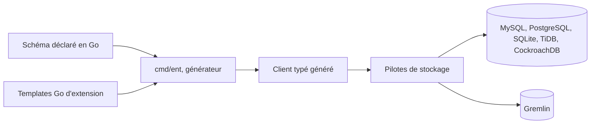

# ent/ent

> **A Go data-access layer where the schema is code and the client is generated.**

## The problem

Without it, working with a large data model in Go means hand-written SQL or a dynamic layer
where query mistakes only surface at runtime. The README frames the target as applications
built around large data models.

## What it actually does

Each entity is declared as a Go object, and a generator produces the typed access API. The
README lists four concrete claims: database schemas modelled as Go objects, graph traversal
with queries and aggregations, a fully statically typed API obtained through code generation,
and several storage drivers — MySQL, MariaDB, TiDB, PostgreSQL, CockroachDB, SQLite and
Gremlin. Extension goes through Go templates. No schema or query example appears in the
README; all usage material is deferred to entgo.io.

## How it is wired



The README describes no internal architecture; the diagram is inferred from the five stated
properties alone. The only named component is the `entgo.io/ent/cmd/ent` command, the code
generator. Package layout, hooks and migrations are not documented here.

## Trying it

```console
go install entgo.io/ent/cmd/ent@latest
```

That is the only command in the README. For a Go-modules install it points to entgo.io and
its page on version compatibility between `entc` and `ent`.

## Cost and traps

Nothing to pay and nothing to provision: a Go toolchain is enough, no API key, no third-party
service. The real cost sits elsewhere. First, code generation: the typed client is an artifact
to regenerate and commit on every schema change. Second, documentation: the README is
deliberately thin and everything lives on entgo.io, so offline onboarding is not possible.
Third, the `entc`/`ent` version compatibility the README explicitly flags.

## What it is not

Not a reflection-based ORM like GORM: without the generation step there is no client. Not a
database engine nor a standalone migration tool — it relies on existing drivers and the README
promises no server-side schema management. Not a distributed graph project either: "traverse
any graph" refers to relations in the relational model, apart from the Gremlin driver. The
README does not document a v1: the roadmap points to an open issue, so the version number is
not settled despite the project's age.

## Alternatives

The README names no competing project and no neighbours were supplied for this repository:
no comparable alternative in the catalogue. The only related project named is `ariga/atlas`,
presented as the team developing and sponsoring ent — a companion for migrations, not a
replacement.

## For you

Limited interest if your data stack is Python: this is a Go backend developer's tool. It does
matter if you write Go services around a relational store — feature-store API, metadata
catalogue, in-house orchestrator — where typed, generated access removes the class of errors
you otherwise find in production. Corporate stewardship (the Atlas team, after a Meta origin)
buys continuity, not independence.
