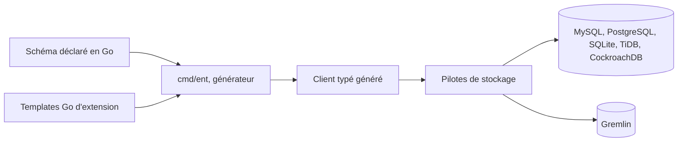

# ent/ent

> **Couche d'accès aux données en Go où le schéma est du code et le client est généré.**

## Le problème

Sans cet outil, manipuler un gros modèle de données en Go revient à écrire du SQL à la main
ou à passer par une couche dynamique où les erreurs de requête n'apparaissent qu'à l'exécution.
Le README pose le cadre comme celui des « applications avec de grands modèles de données ».

## Ce que ça fait vraiment

On décrit chaque entité comme un objet Go, puis un générateur produit l'API d'accès typée.
Le README annonce quatre points concrets : schéma modélisé en objets Go, parcours de graphe
avec requêtes et agrégations, API entièrement typée statiquement obtenue par génération de
code, et plusieurs pilotes de stockage — MySQL, MariaDB, TiDB, PostgreSQL, CockroachDB,
SQLite et Gremlin. L'extension se fait via des templates Go. Le README ne montre aucun
exemple de schéma ni de requête : tout le contenu d'usage est renvoyé vers entgo.io.

## Comment c'est branché



Le README ne décrit pas l'architecture interne ; ce schéma se déduit uniquement des cinq
propriétés annoncées. La seule pièce nommée est la commande `entgo.io/ent/cmd/ent`, qui est
l'outil de génération. Le reste — organisation des paquets, hooks, migrations — n'est pas
documenté ici.

## Essayer

```console
go install entgo.io/ent/cmd/ent@latest
```

C'est la seule commande présente dans le README. Pour une installation via les modules Go,
il renvoie vers entgo.io et sa page de compatibilité de versions entre `entc` et `ent`.

## Coût et pièges

Rien à payer, rien à provisionner : une chaîne Go suffit, pas de clé d'API ni de service tiers.
Le vrai coût est ailleurs. D'abord la génération de code : le client typé est un artefact à
régénérer et à versionner à chaque changement de schéma. Ensuite la documentation : le README
est volontairement creux et tout passe par le site entgo.io, donc une prise en main hors ligne
est impossible. Enfin la compatibilité `entc`/`ent`, que le README signale explicitement comme
un point à vérifier.

## Ce que ce n'est pas

Ce n'est pas un ORM à réflexion à la GORM : sans étape de génération, il n'y a pas de client.
Ce n'est pas un moteur de base de données ni un outil de migration autonome — il s'appuie sur
des pilotes existants, et le README ne promet aucune gestion de schéma côté serveur. Ce n'est
pas non plus un projet de graphe distribué : « traverser un graphe » désigne les relations du
modèle relationnel, pas une base orientée graphe, hormis le pilote Gremlin. Le README ne
documente pas la v1 : la feuille de route pointe vers une issue ouverte, donc le numéro de
version n'est pas stabilisé malgré l'ancienneté du projet.

## Alternatives

Le README ne cite aucun projet concurrent, et aucun voisin n'a été fourni pour ce dépôt :
aucune alternative comparable dans le catalogue. Le seul projet apparenté nommé est
`ariga/atlas`, présenté comme l'équipe qui développe et sponsorise ent — donc un compagnon
pour les migrations, pas un substitut.

## Pour toi

Intérêt limité si ta stack data est en Python : c'est un outil de développeur backend Go.
Il compte en revanche si tu écris des services Go autour d'un entrepôt relationnel — API de
feature store, catalogue de métadonnées, orchestrateur maison — où un accès typé et généré
évite la classe d'erreurs qu'on découvre en production. La gouvernance par une entreprise
(l'équipe Atlas, après une origine Meta) est un gage de continuité, pas d'indépendance.
