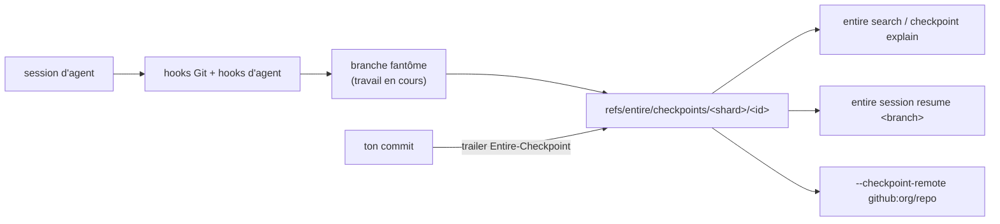

# entireio/cli

> Capture les sessions d'agents de code et les indexe à côté des commits Git, sans les polluer.

## Le problème
Après un commit écrit par un agent, il ne reste que le diff : le prompt, le raisonnement et les
fichiers touchés ont disparu, et reprendre une session abandonnée par un collègue est impossible.

## Ce que ça fait vraiment
`entire enable` installe des hooks Git et des hooks d'agent qui enregistrent la session au fil de
l'eau sur une branche fantôme éphémère. Au commit, ce travail est condensé en un checkpoint permanent
stocké comme ref Git indépendante `refs/entire/checkpoints/<shard>/<id>`, dont l'arbre *est* le
checkpoint (`metadata.json`, transcripts par session, enregistrements de sous-agents) ; le commit
porte un trailer `Entire-Checkpoint:`. Aucun commit n'est créé sur la branche active. Les refs étant
indépendantes, deux sessions concurrentes ne se disputent aucun sommet de branche, et un checkpoint
écrit sur une autre machine est récupéré à la demande. Les identifiants de session sont ceux fournis
par l'agent lui-même, jamais forgés par Entire.

## Comment c'est branché


## Essayer
```bash
brew install --cask entireio/tap/entire
# ou : curl -fsSL https://entire.io/install.sh | bash
cd your-project && entire enable --agent claude-code
entire status
entire session resume <branch>
git for-each-ref refs/entire/checkpoints
entire checkpoint list
entire checkpoint explain <id>
ENTIRE_TOKEN_STORE=file entire login
entire disable
```

## Coût et pièges
`entire login` ouvre un navigateur et stocke les jetons dans le trousseau de l'OS ; en CI ou headless
il faut `--device`, `ENTIRE_TOKEN_STORE=file` ou injecter `ENTIRE_TOKEN` à chaque appel. Des
analytics anonymes sont actives par défaut (`--telemetry=false` pour couper). Un plan de contrôle
distant (orgs, projets, clusters) existe, et son tarif n'est pas documenté dans le README.

## Ce que ce n'est pas
Pas un outil local pur : les commandes `cluster`, `org`, `project`, `repo` parlent à un service
hébergé, et le CLI dérive son endpoint du jeton. Pas un remplaçant de revue de code. Les commandes
`review`, `investigate`, `blame`, `why`, `import` sont expérimentales, masquées en stable.

## Alternatives
Aucune alternative nommée dans le README.

## Pour toi
Le stockage en refs Git est la bonne idée ; le plan de contrôle SaaS est le point à trancher avant.
